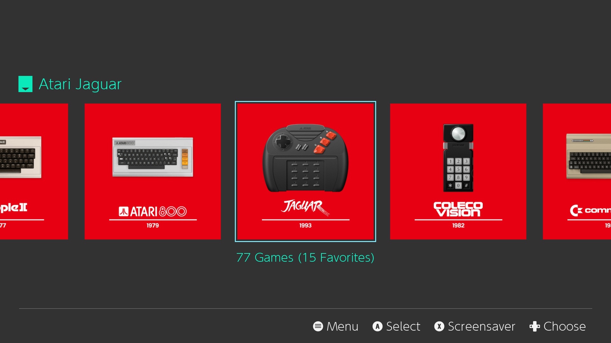
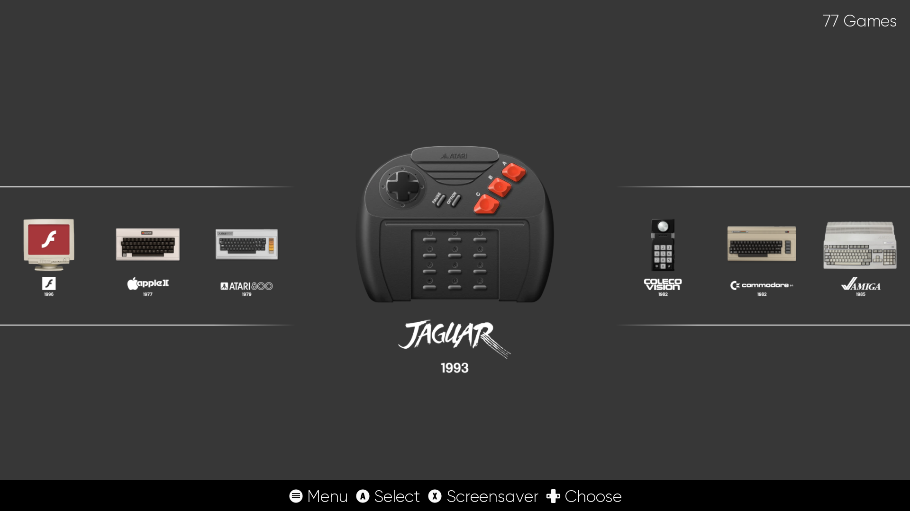

# Carousel icons for ES-DE Frontend

These icons are forked from the [es-de-moderntheme-nsoicons](https://github.com/szymon-kulak/es-de-moderntheme-nsoicons) repository by Szymon Kulak.

There are two sets of icons, in NSO style as well as simplified variants.

All icons are in [WebP](https://en.wikipedia.org/wiki/WebP) format and were exported from [Gimp](https://www.gimp.org) with lossy compression and _Image quality_ set to 90 and _Alpha quality_ set to 100.

_NSO-style icons (Modern theme)_

_Simplified icons (Linear theme)_
