# ES-DE Frontend - Themes

Themes are most easily installed using the built-in theme downloader that is accessible from the _UI Settings_ menu. The exception is themes listed under the [Additional themes](https://gitlab.com/es-de/themes/themes-list#additional-themes) section as these need to be manually installed.

All screenshots are in 16:9 aspect ratio at 1920x1080 resolution.

Variants, color schemes, font sizes, aspect ratios, transitions and languages can be changed from the _UI Settings_ menu.

Note that having support for a language may not mean that all text has yet been translated, as complete localization is a long term undertaking.

Table of contents:

[[_TOC_]]

### Adroit
https://github.com/RickAndTired/adroit-es-de

**Created by**\
Rick

**Variants**\
Grid Covers\
Grid Logos\
List\
List No Art

**Color schemes**\
Dark\
Light\
Animated

**Font sizes**\
Medium\
Large

**Aspect ratios**\
16:9\
16:10\
4:3\
19.5:9\
21:9\
1:1

**Transitions**\
Instant\
Slide\
Fade

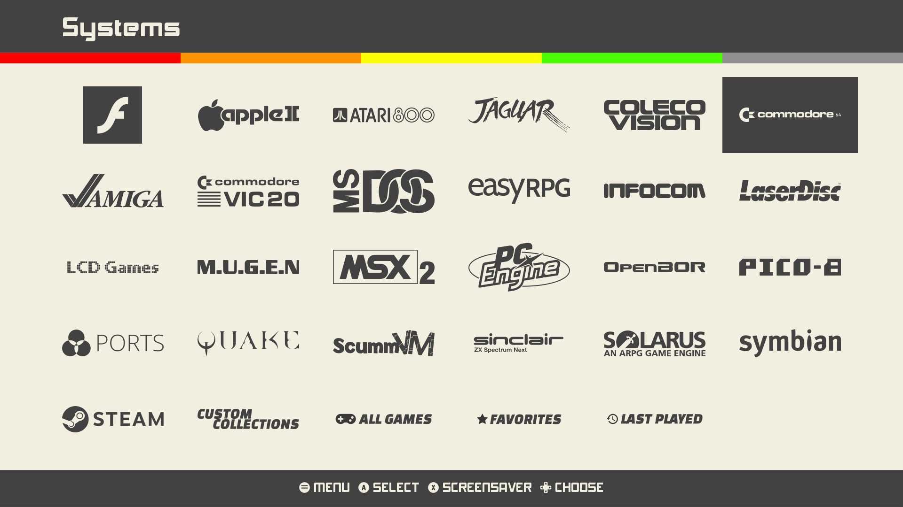
_System view, Grid Covers variant, Light color scheme_

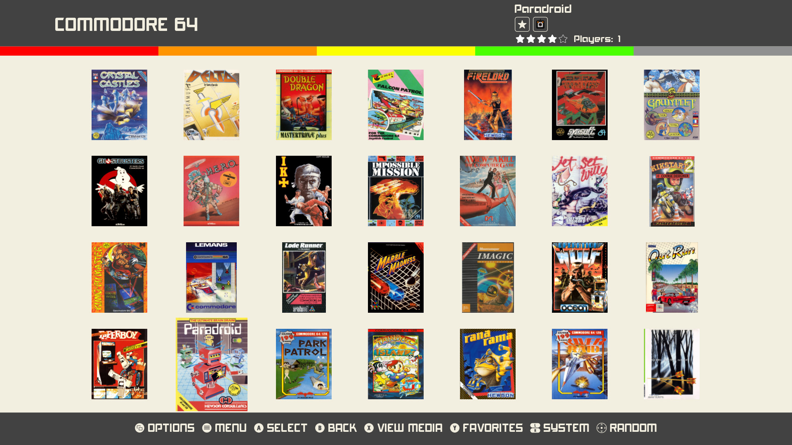
_Gamelist view, Grid Covers variant, Light color scheme_

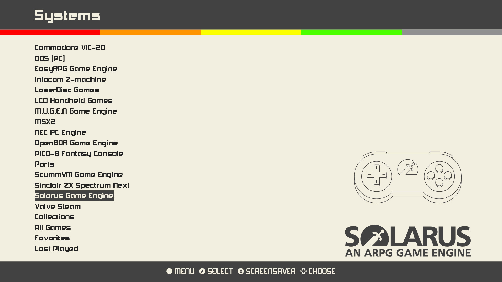
_System view, List variant, Light color scheme_

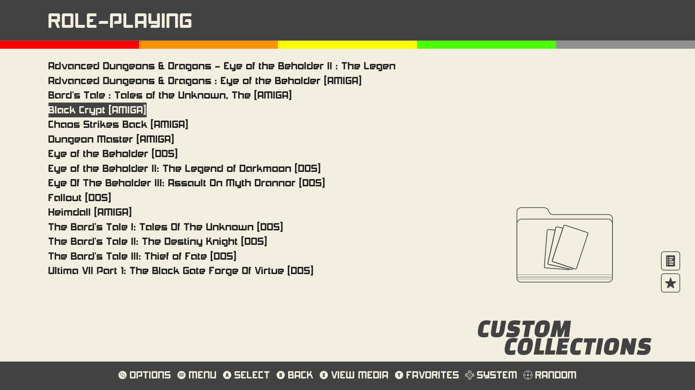
_Gamelist view, List variant, Light color scheme_

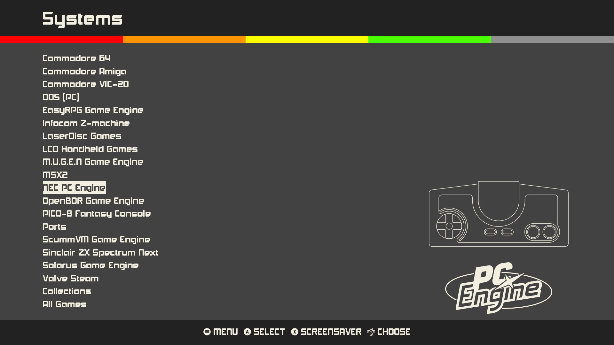
_System view, List variant, Dark color scheme_

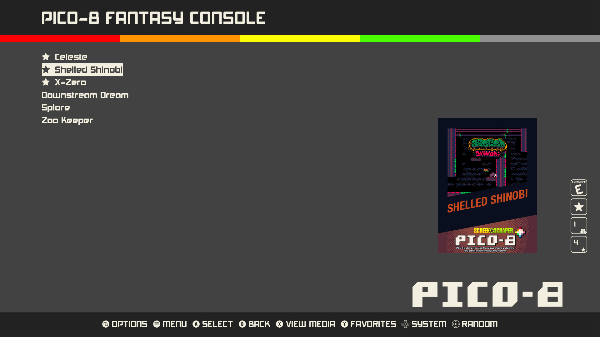
_Gamelist view, List variant, Dark color scheme_

---

### Alekfull NX (Revisited)
https://github.com/anthonycaccese/alekfull-nx-es-de

**Created by**\
ant and fagnerpc

**Variants**\
List: Metadata & Miximage\
List: Metadata & Boxart\
List: Miximage\
List: Boxart

**Color schemes**\
Light\
Dark\
Light (Custom Images)\
Dark (Custom Images)

**Font sizes**\
Medium\
Large\
Extra large

**Aspect ratios**\
16:9\
16:10\
4:3\
19.5:9

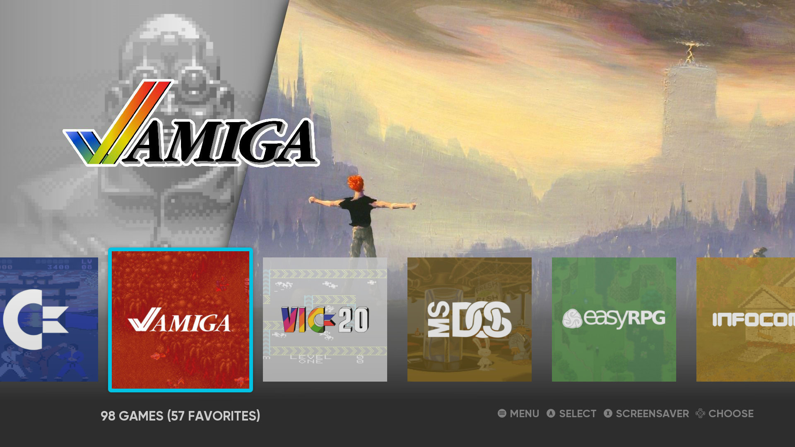
_System view, List: Metadata & Miximage variant, Dark color scheme_

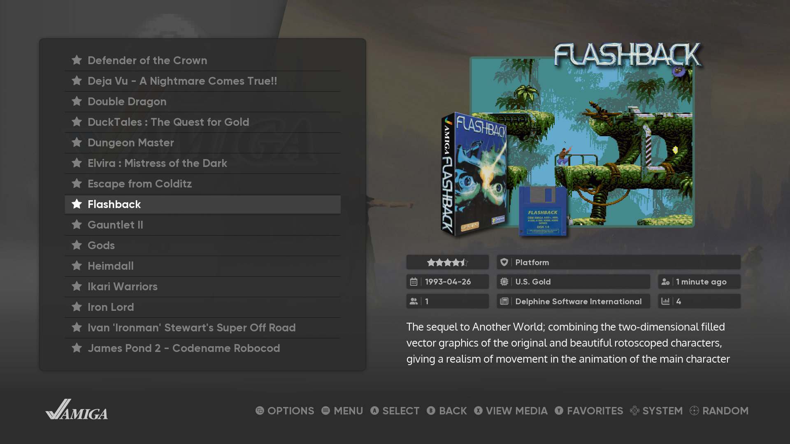
_Gamelist view, List: Metadata & Miximage variant, Dark color scheme_

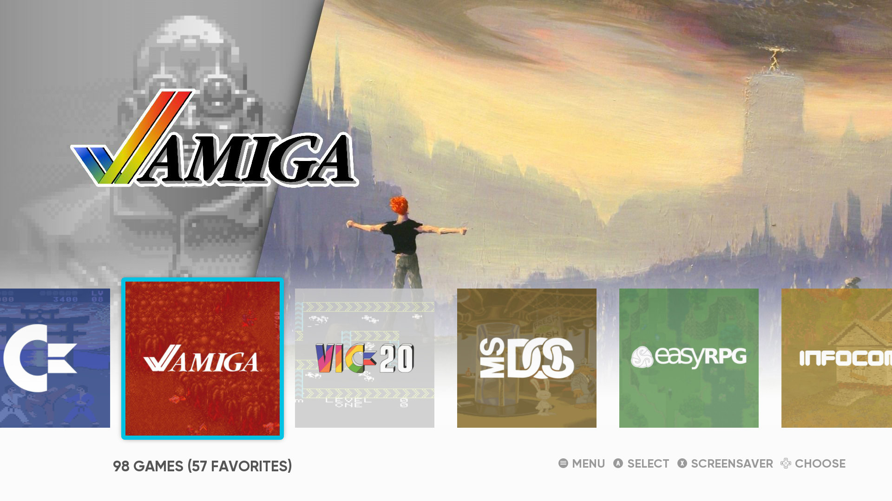
_System view, List: Metadata & Miximage variant, Light color scheme_

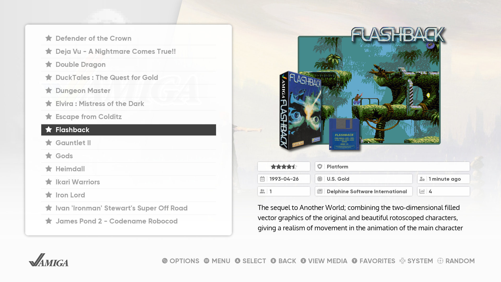
_Gamelist view, List: Metadata & Miximage variant, Light color scheme_

---

### Analogue 3D OS Menu
https://github.com/seanfletchr/analogue-3d-menu-es-de

**Created by**\
Sean

**Variants**\
Carousel (Carts)\
Carousel (Covers)\
Carousel (Caps)\
List\
Grid (Large)\
Grid (Small)\
Gallery (Fit)\
Gallery (Fill)

**Color schemes**\
No Background\
Screenshot (Static)\
Title Screen (Static)\
Fanart (Static)\
Screenshot (Video)\
Title Screen (Video)\
Fanart (Video)\
Custom

**Font sizes**\
Medium\
Large\
Small

**Aspect ratios**\
16:9\
16:10\
3:2\
4:3\
8:7\
1:1

**Languages**\
English (United States)\
Bosanski\
Català\
Deutsch\
Español (España)\
Français\
Hrvatski\
Italiano\
Nederlands\
Polski\
Português (Brasil)\
Português (Portugal)\
Română\
Русский\
Srpski\
Svenska\
العربية\
日本語\
한국어\
简体中文\
繁體中文

 variant, No Background color scheme")
_System view, Carousel (Caps) variant, No Background color scheme_

 variant, No Background color scheme")
_Gamelist view, Carousel (Caps) variant, No Background color scheme_

 variant, Screenshot (Static) color scheme")
_System view, Grid (Small) variant, Screenshot (Static) color scheme_

 variant, Screenshot (Static) color scheme")
_Gamelist view, Grid (Small) variant, Screenshot (Static) color scheme_

---

### Analogue OS Menu
https://github.com/anthonycaccese/analogue-os-menu-es-de

**Created by**\
ant

**Variants**\
List\
Carousel\
Grid

**Color schemes**\
Dark\
Light\
Custom

**Aspect ratios**\
16:9\
16:10\
3:2\
4:3\
19.5:9\
1:1

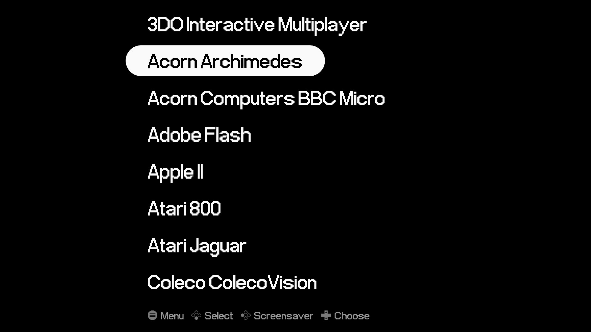
_System view, Grid variant, Dark color scheme_

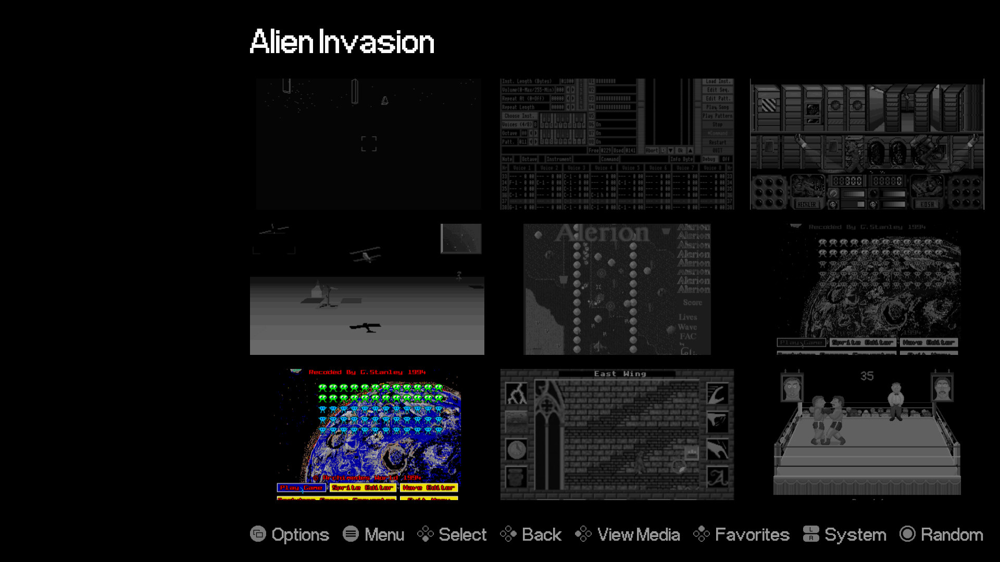
_Gamelist view, Grid variant, Dark color scheme_

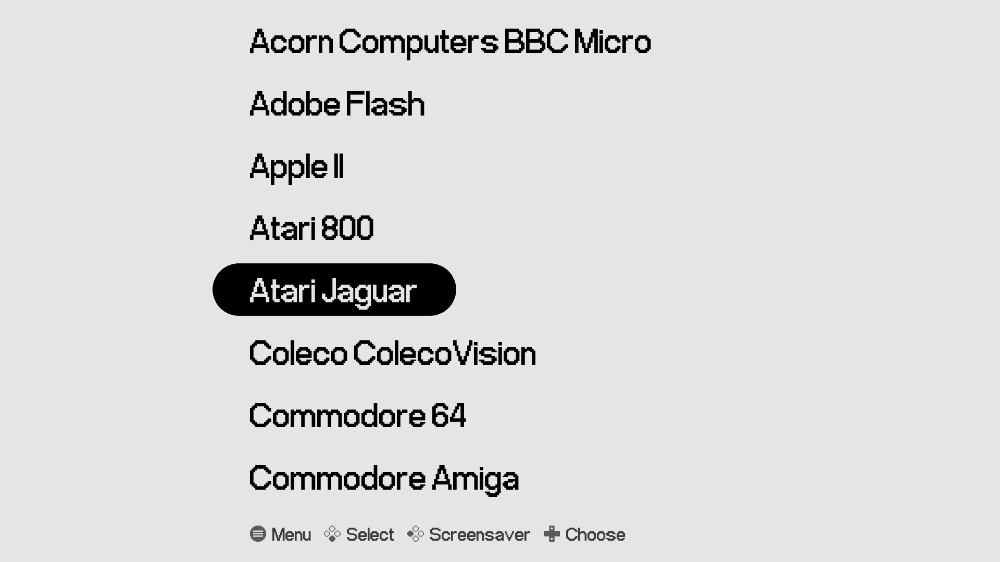
_System view, Carousel variant, Light color scheme_

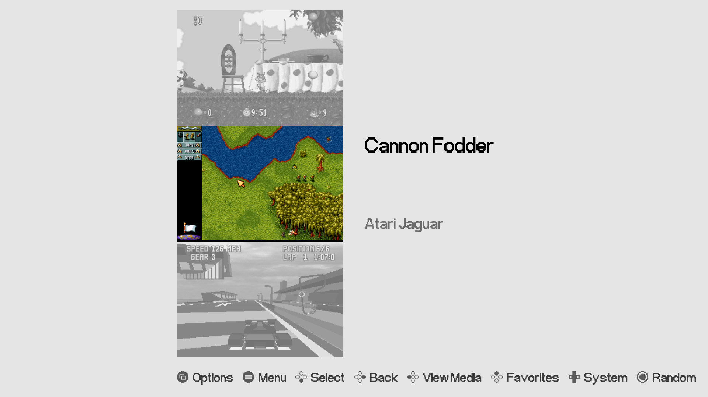
_Gamelist view, Carousel variant, Light color scheme_

---

### Art Book Next
https://github.com/anthonycaccese/art-book-next-es-de

**Created by**\
ant

**Variants**\
List: Metadata & Boxart\
List: Metadata & Screenshot + Marquee\
List: Metadata & Screenshot + Boxart\
List: Metadata & Miximage\
List: Boxart\
List: Screenshot + Marquee\
List\
Grid: Boxart\
Grid: Boxart (SteamGridDB)\
Grid: Screenshot\
[Help Off] List: Metadata & Boxart\
[Help Off] List: Metadata & Screenshot + Marquee\
[Help Off] List: Metadata & Screenshot + Boxart\
[Help Off] List: Metadata & Miximage\
[Help Off] List: Boxart\
[Help Off] List: Screenshot + Marquee\
[Help Off] List\
[Help Off] Grid: Boxart\
[Help Off] Grid: Boxart (SteamGridDB)\
[Help Off] Grid: Screenshot

**Color schemes**\
Dark [Screenshots]\
Dark [Noir]\
Dark [Circuit]\
Dark [Outline]\
Dark [Original Screenshots]\
OLED [Screenshots]\
OLED [Noir]\
OLED [Circuit]\
OLED [Outline]\
OLED [Original Screenshots]\
Light [Screenshots]\
Light [Noir]\
Light [Circuit]\
Light [Outline]\
Light [Original Screenshots]\
Steam OS [Screenshots]\
Steam OS [Noir]\
Steam OS [Circuit]\
Steam OS [Outline]\
Steam OS [Original Screenshots]\
SNES [Screenshots]\
SNES [Noir]\
SNES [Circuit]\
SNES [Outline]\
SNES [Original Screenshots]\
Famicom [Screenshots]\
Famicom [Noir]\
Famicom [Circuit]\
Famicom [Outline]\
Famicom [Original Screenshots]\
Custom

**Font sizes**\
Medium\
Large\
Small\
Extra large

**Aspect ratios**\
16:9\
16:10\
3:2\
4:3\
5:3 vertical\
5:4\
8:7\
19.5:9\
20:9\
21:9\
32:9\
1:1

**Transitions**\
Instant\
Slide

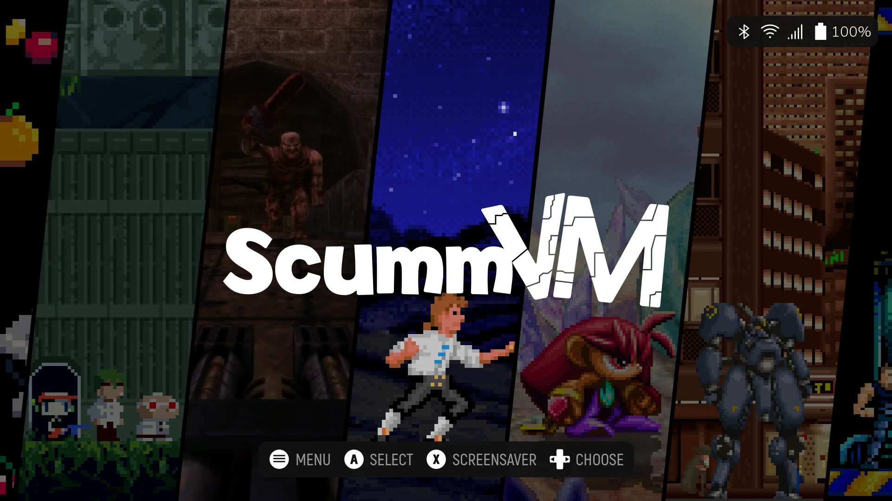
_System view, List: Metadata & Miximage variant, Dark [Screenshots] color scheme_

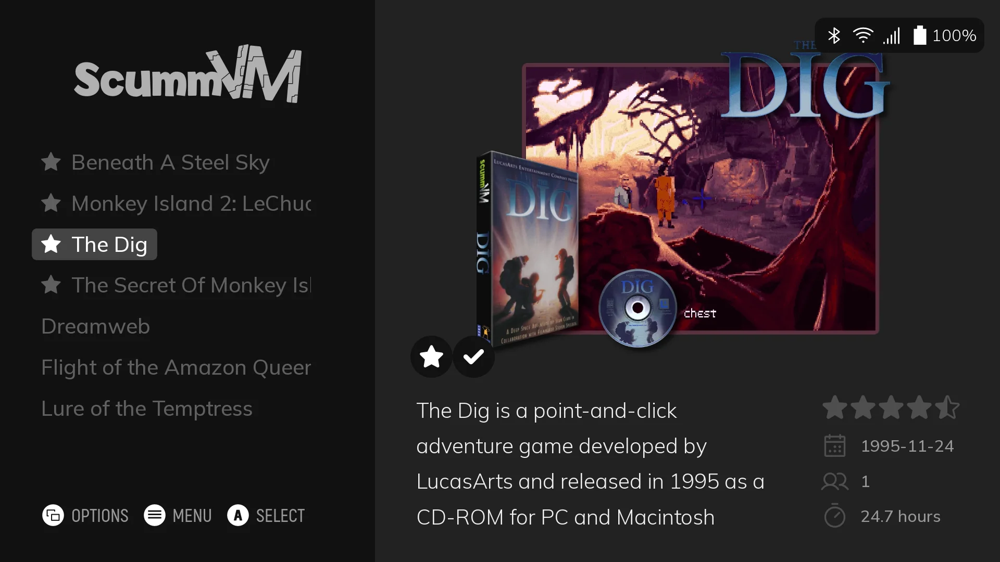
_Gamelist view, List: Metadata & Miximage variant, Dark [Screenshots] color scheme_

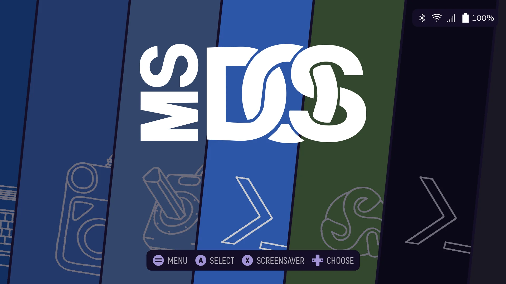
_System view, Grid: Boxart variant, SNES [Outline] color scheme_

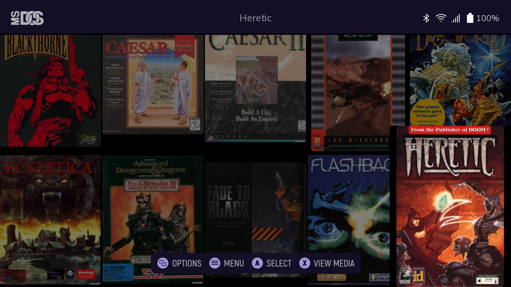
_Gamelist view, Grid: Boxart variant, SNES [Outline] color scheme_

---

### Artflix (Revisited)
https://github.com/TheGrizzMD/artflix-revisited-es-de

**Created by**\
TheGrizzMD and Alekfull

**Variants**\
Default\
Default Immersive\
Covers Carousel\
Covers Carousel Immersive

**Font sizes**\
Medium\
Large

**Aspect ratios**\
16:9\
16:10\
4:3\
19.5:9

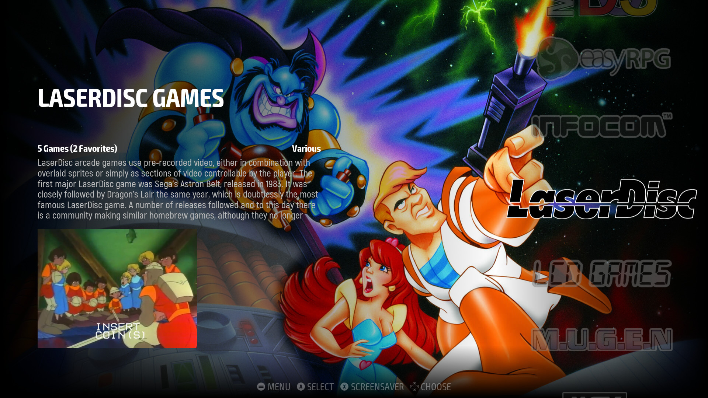
_System view, Default variant_

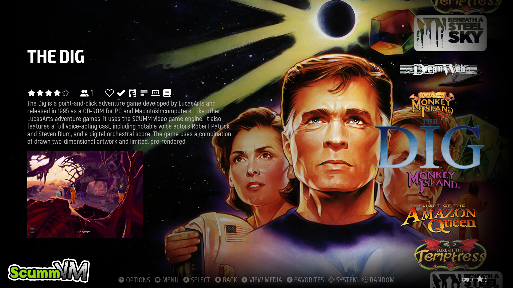
_Gamelist view, Default variant_

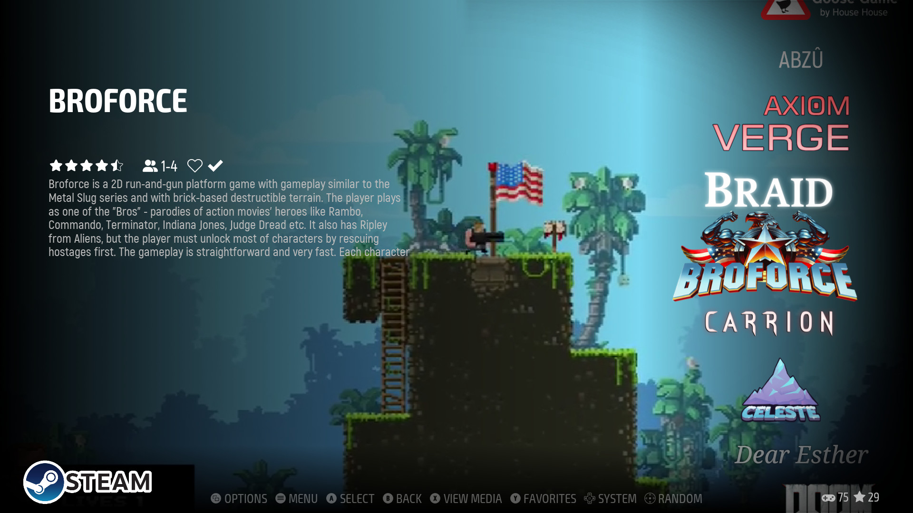
_Gamelist view, Default Immersive variant_

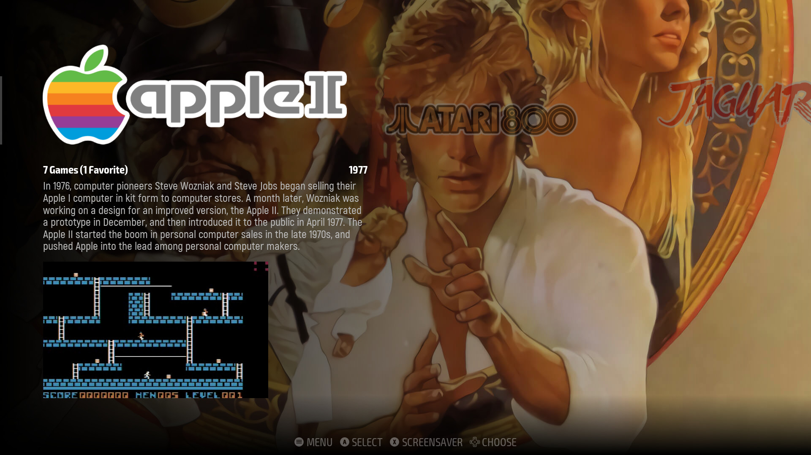
_System view, Covers Carousel variant_

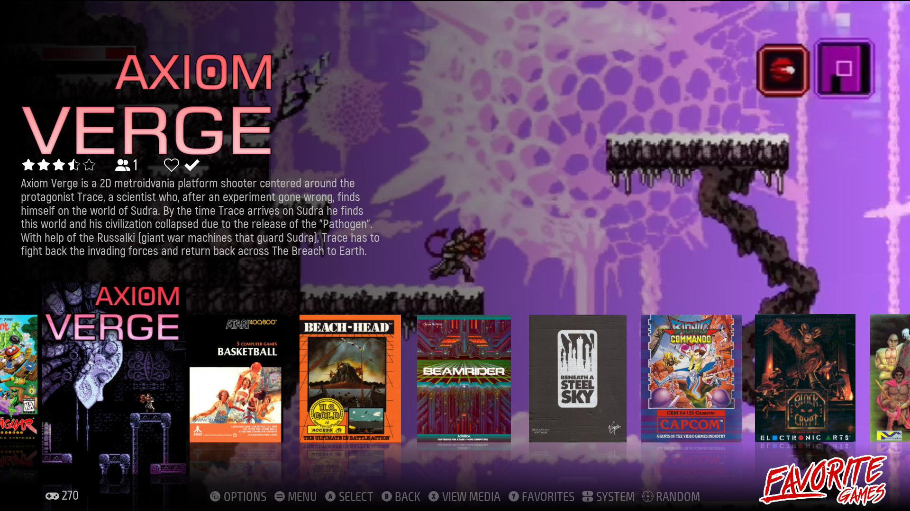
_Gamelist view, Covers Carousel Immersive variant_

---

### Atari 50 Menu
https://github.com/anthonycaccese/atari-50-menu-es-de

**Created by**\
ant

**Aspect ratios**\
16:9\
16:10\
4:3

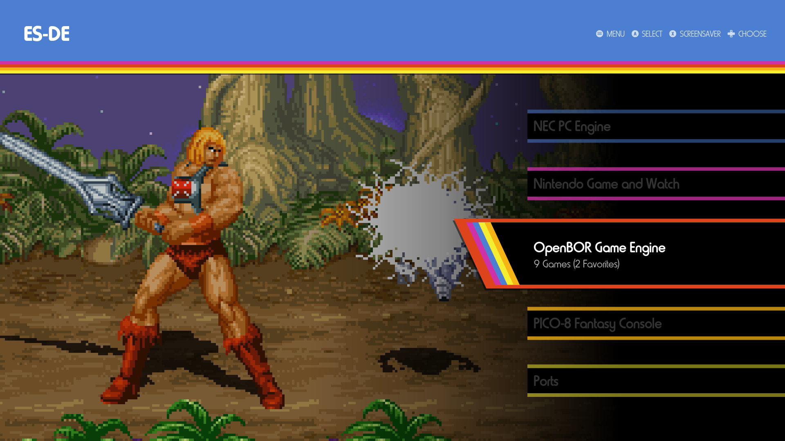
_System view_

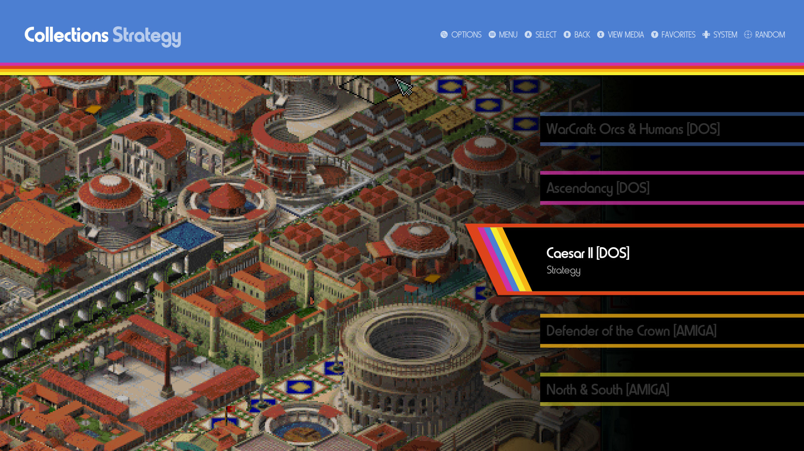
_Gamelist view_

---

### Aura
https://github.com/Siddy212/aura-es-de

**Created by**\
Siddy212

**Variants**\
[Carousel] Textlist\
[Carousel] Detailed-Grid\
[Carousel] Detailed-Grid (Help Off)\
[Carousel] Basic-Grid\
[Carousel] Basic-Grid (Help Off)\
[Carousel] Carousel-Marquee\
[Carousel] Carousel-Boxart\
[Carousel] Carousel-Boxart (Immersive)\
[Fullscreen] Textlist\
[Fullscreen] Detailed-Grid\
[Fullscreen] Detailed-Grid (Help Off)\
[Fullscreen] Basic-Grid\
[Fullscreen] Basic-Grid (Help Off)\
[Fullscreen] Carousel-Marquee\
[Fullscreen] Carousel-Boxart\
[Fullscreen] Carousel-Boxart (Immersive)\
[Grid] Textlist\
[Grid] Detailed-Grid\
[Grid] Detailed-Grid (Help Off)\
[Grid] Basic-Grid\
[Grid] Basic-Grid (Help Off)\
[Grid] Carousel-Marquee\
[Grid] Carousel-Boxart\
[Grid] Carousel-Boxart (Immersive)\

**Color schemes**\
[Controller] Violet\
[Controller] Purple\
[Controller] Blue\
[Controller] Green\
[Controller] Orange\
[Controller] Black\
[Controller] Pocket Light\
[Controller] Pocket Dark\
[Logo] Violet\
[Logo] Purple\
[Logo] Blue\
[Logo] Green\
[Logo] Orange\
[Logo] Black\
[Logo] Pocket Light\
[Logo] Pocket Dark\
[Art] Light Glass\
[Art] Dark Glass\
[Art] Violet\
[Art] Purple\
[Art] Blue\
[Art] Green\
[Art] Orange\
[Art] Black\
[Art] Pocket Light\
[Art] Pocket Dark

**Font sizes**\
Medium\
Large\
Small\
Extra large

**Aspect ratios**\
16:9\
16:10\
3:2\
4:3\
8:7\
19.5:9\
21:9\
1:1

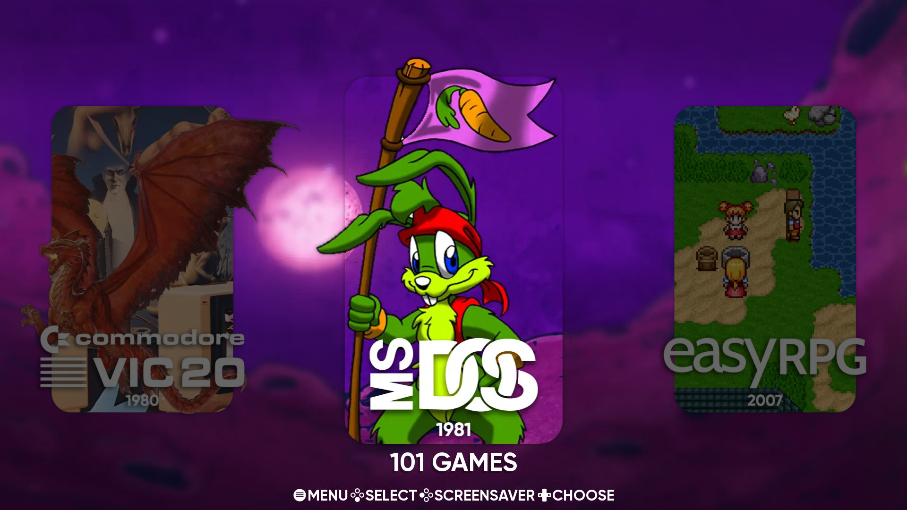
_System view, [Carousel] Textlist variant, [Art] Light Glass color scheme_

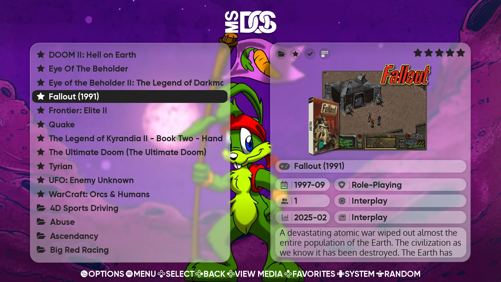
_Gamelist view, [Carousel] Textlist variant, [Art] Light Glass color scheme_

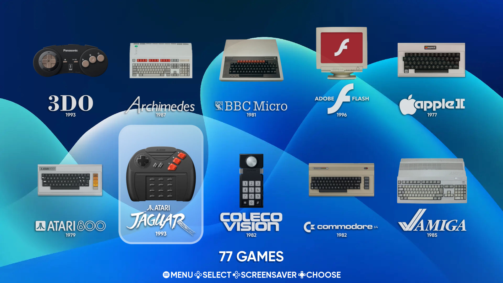
_System view, [Grid] Detailed-Grid variant, [Controller] Blue color scheme_

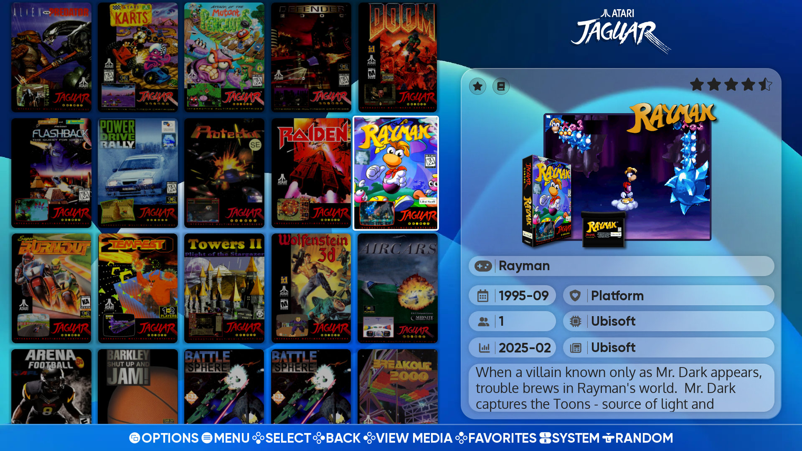
_Gamelist view, [Grid] Detailed-Grid variant, [Controller] Blue color scheme_

---

### BASIC
https://github.com/Weestuarty-es-de/basic-es-de

**Created by**\
Weestuarty

**Variants**\
ZX Spectrum\
Commodore 64\
Amstrad CPC

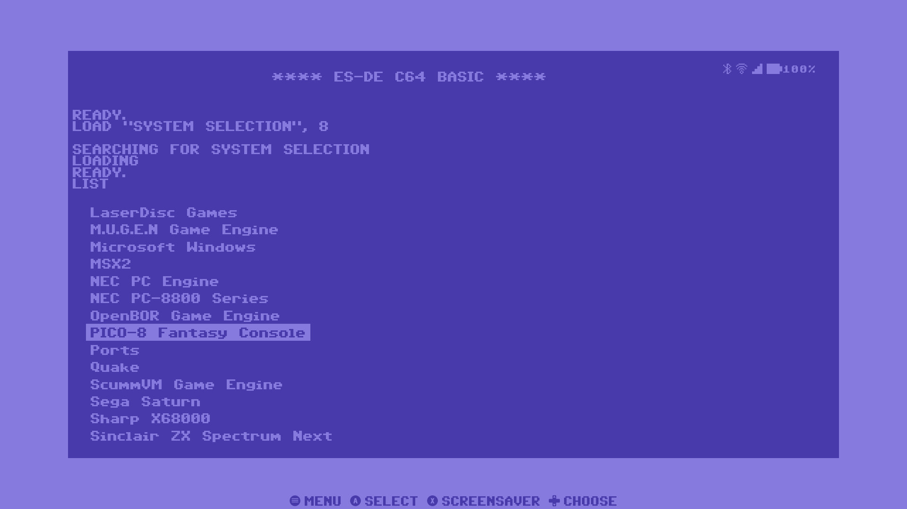
_System view, Commodore 64 variant_

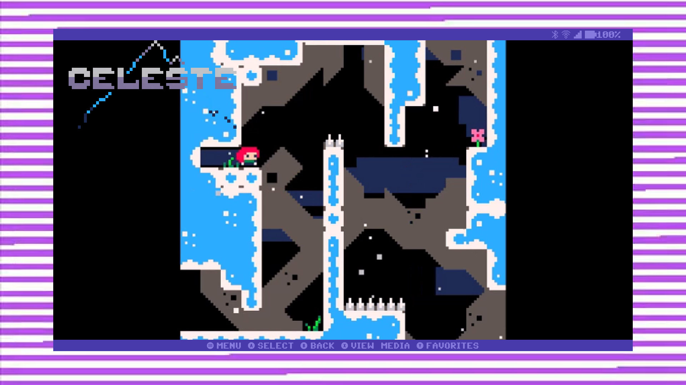
_Gamelist view, Commodore 64 variant_

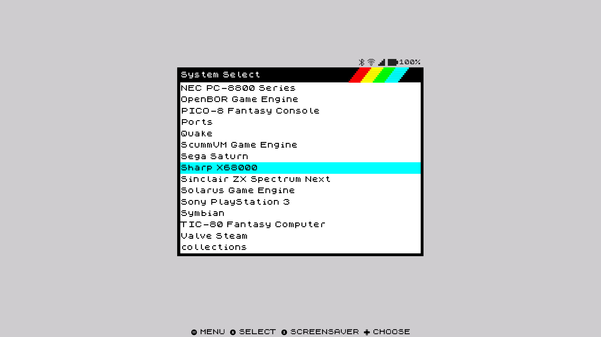
_System view, ZX Spectrum variant_

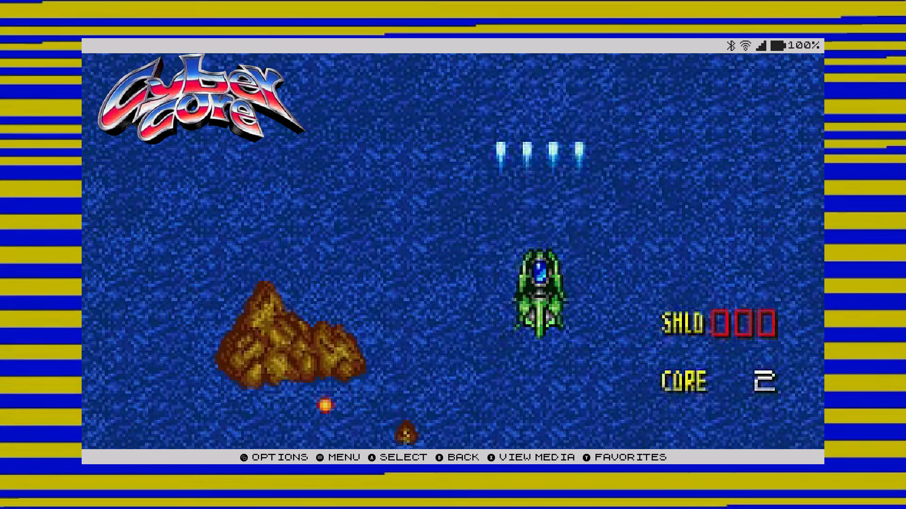
_Gamelist view, ZX Spectrum variant_

---

### Canvas
https://github.com/Siddy212/canvas-es-de

**Created by**\
Siddy212

**Variants**\
[Grid] Textlist\
[Grid] Textlist - Flipped\
[Grid] Carousel: Marquee\
[Grid] Carousel: Boxart\
[Grid] Grid: Basic\
[Grid] Grid: Detailed\
[Grid] Grid: Detailed - Flipped\
[Grid] Row\
[Carousel] Textlist\
[Carousel] Textlist - Flipped\
[Carousel] Carousel: Marquee\
[Carousel] Carousel: Boxart\
[Carousel] Grid: Basic\
[Carousel] Grid: Detailed\
[Carousel] Grid: Detailed - Flipped\
[Carousel] Row

**Color schemes**\
[Capsule] Dark\
[Capsule] Light\
[Capsule] Retro\
[Capsule] Pocket Light\
[Capsule] Pocket Medium\
[Capsule] Pocket Dark\
[Capsule] Neon\
[Capsule] Pastel\
[Capsule] Sony\
[Capsule] NES\
[Capsule] SNES\
[Capsule] Famicom\
[Controller] Dark\
[Controller] Light\
[Controller] Retro\
[Controller] Pocket Light\
[Controller] Pocket Medium\
[Controller] Pocket Dark\
[Controller] Neon\
[Controller] Pastel\
[Controller] Sony\
[Controller] NES\
[Controller] SNES\
[Controller] Famicom\
[Logo] Dark\
[Logo] Light\
[Logo] Retro\
[Logo] Pocket Light\
[Logo] Pocket Medium\
[Logo] Pocket Dark\
[Logo] Neon\
[Logo] Pastel\
[Logo] Sony\
[Logo] NES\
[Logo] SNES\
[Logo] Famicom\
[Screenshot] Dark\
[Screenshot] Light\
[Screenshot] Retro\
[Screenshot] Pocket Light\
[Screenshot] Pocket Medium\
[Screenshot] Pocket Dark\
[Screenshot] Neon\
[Screenshot] Pastel\
[Screenshot] Sony\
[Screenshot] NES\
[Screenshot] SNES\
[Screenshot] Famicom\
[Art] Dark\
[Art] Light\
[Art] Retro\
[Art] Pocket Light\
[Art] Pocket Medium\
[Art] Pocket Dark\
[Art] Neon\
[Art] Pastel\
[Art] Sony\
[Art] NES\
[Art] SNES\
[Art] Famicom

**Font sizes**\
Medium\
Large\
Small\
Extra large

**Aspect ratios**\
16:9\
16:10\
3:2\
4:3\
8:7\
19.5:9\
21:9\
1:1

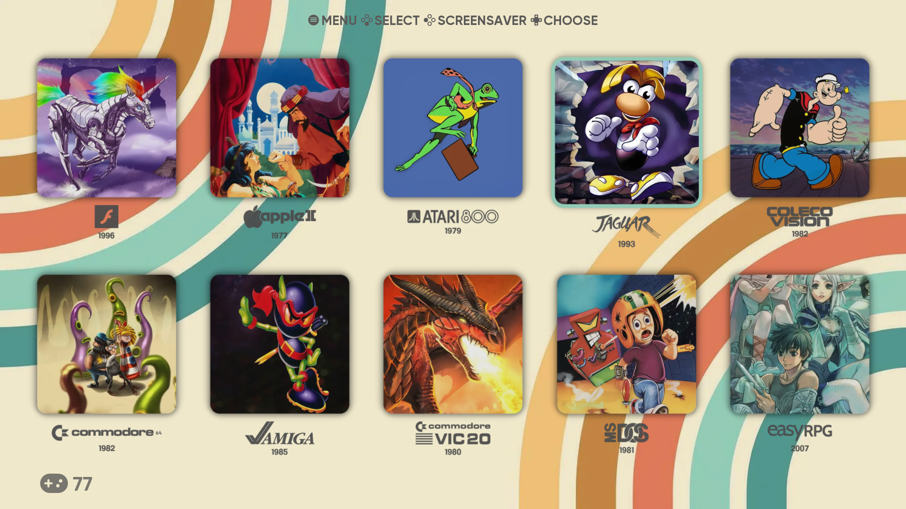
_System view, [Grid] Textlist variant, [Art] Retro color scheme_

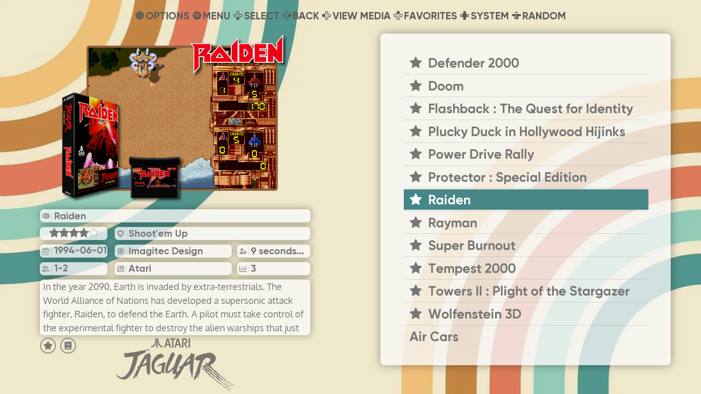
_Gamelist view, [Grid] Textlist variant, [Art] Retro color scheme_

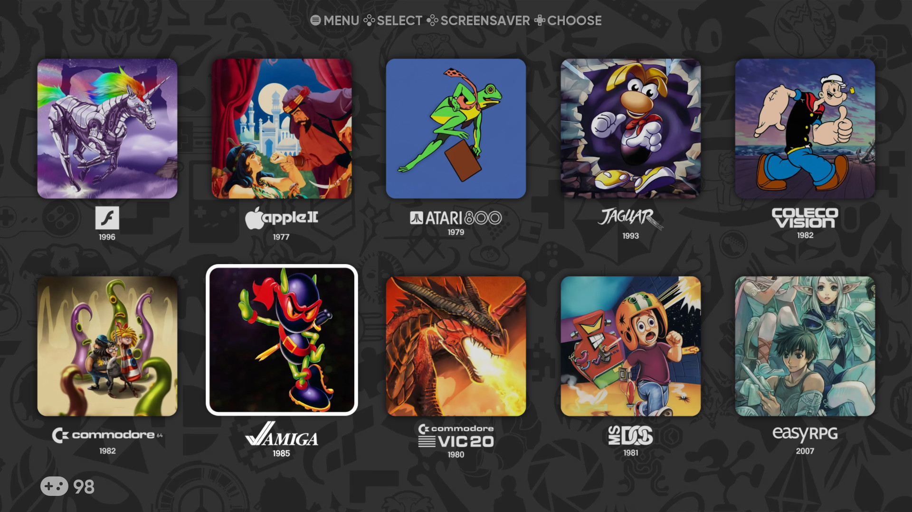
_System view, [Grid] Carousel: Marquee variant, [Art] Dark color scheme_

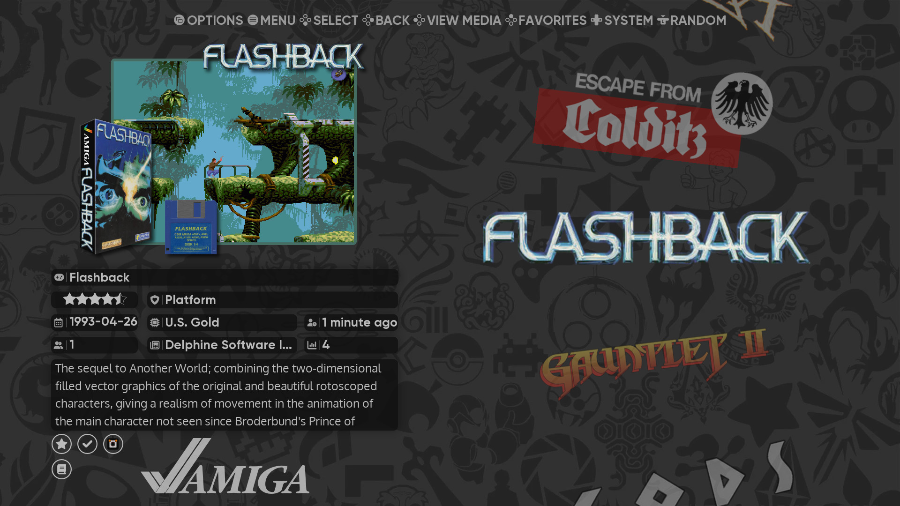
_Gamelist view, [Grid] Carousel: Marquee variant, [Art] Dark color scheme_

---

### CarAlt
https://github.com/Weestuarty-es-de/caralt-es-de

**Created by**\
Weestuarty

**Variants**\
With videos\
Without videos

**Color schemes**\
Gold\
Black & white\
Blue\
Gameboy\
Gameboy Shell\
Retro\
Stay Classy\
Commodore 64\
Chilled\
Purple Rain\
Rusty\
Sega

**Font sizes**\
Medium\
Large\
Extra large

**Aspect ratios**\
16:9\
16:10\
4:3\
21:9

**Transitions**\
Instant w/Fade\
Instant

**Languages**\
English (United States)\
English (United Kingdom)\
Bosanski\
Català\
Deutsch\
Español (España)\
Français\
Hrvatski\
Italiano\
Nederlands\
Polski\
Português (Brasil)\
Português (Portugal)\
Română\
Русский\
Srpski\
Svenska\
日本語\
한국어\
简体中文\
繁體中文

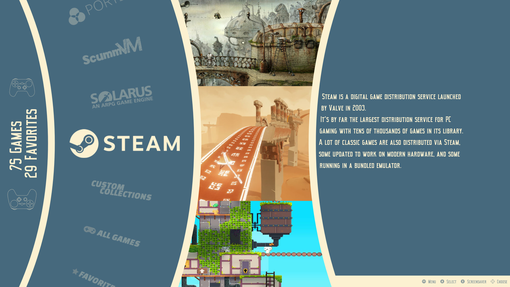
_System view, Chilled color scheme_

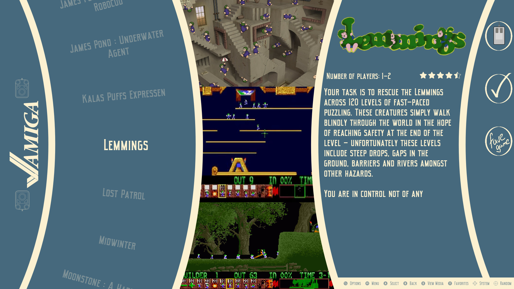
_Gamelist view, With videos variant, Chilled color scheme_

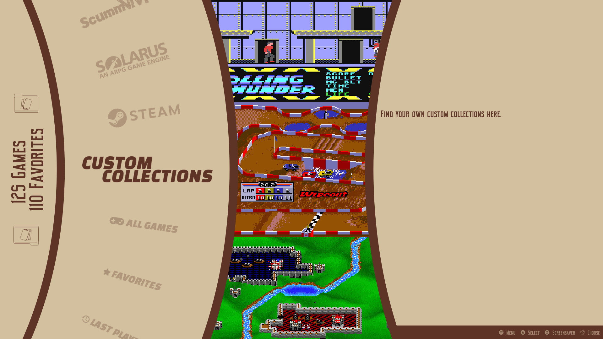
_System view, Retro color scheme_

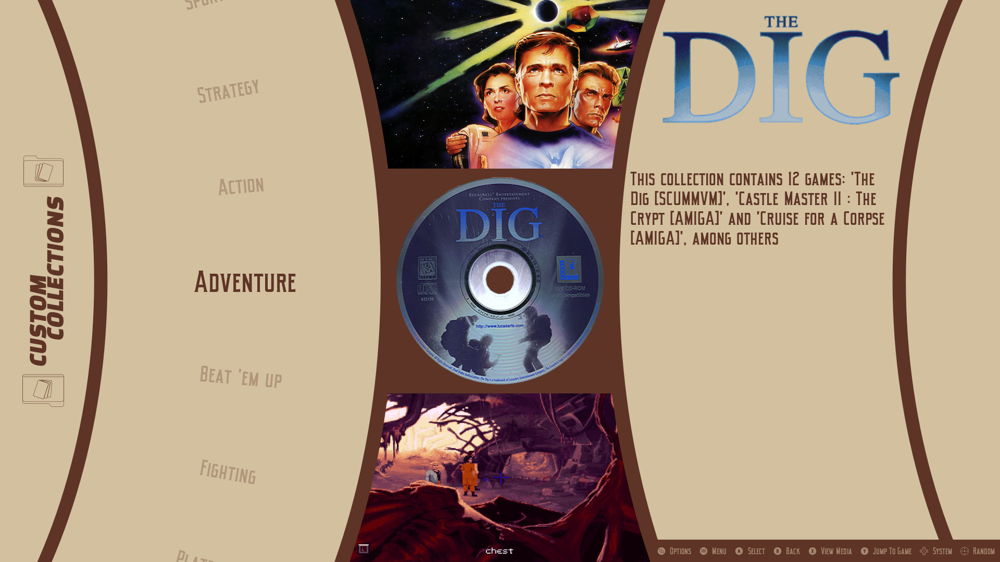
_Gamelist view, Without videos variant, Retro color scheme_

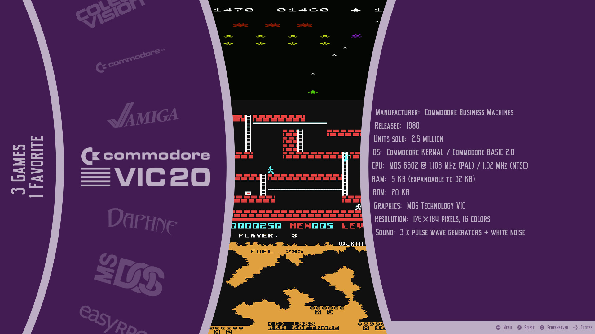
_System view, Purple Rain color scheme_

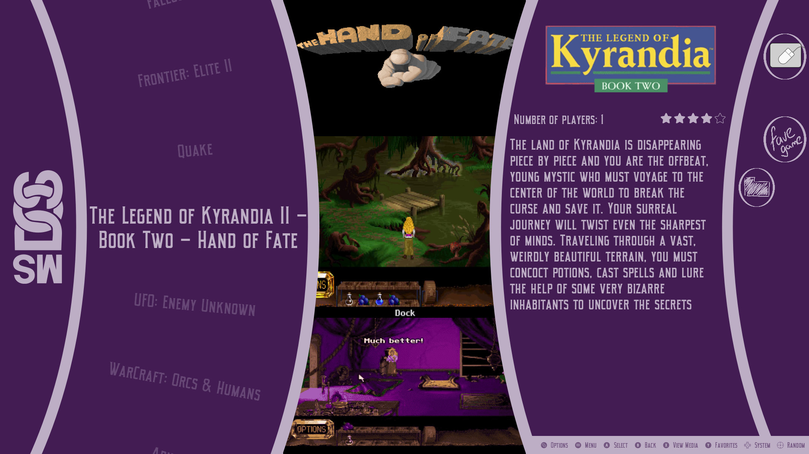
_Gamelist view, With videos variant, Purple Rain color scheme_

---

### Carbon
https://github.com/lilbud/carbon-es-de

**Created by**\
lilbud and Rookervik

**Color schemes**\
Red\
Blue\
Green\
Yellow\
Orange\
Purple\
Teal\
Pink

**Font sizes**\
Medium\
Large

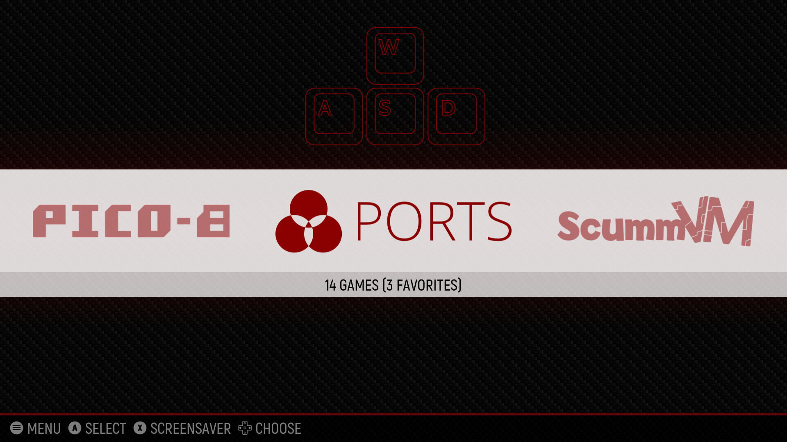
_System view, Red color scheme_

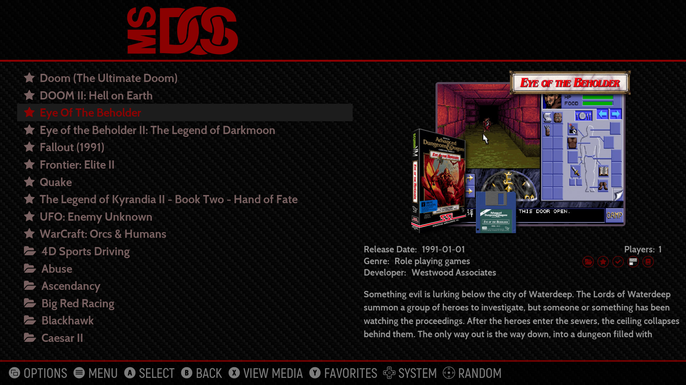
_Gamelist view, Red color scheme_

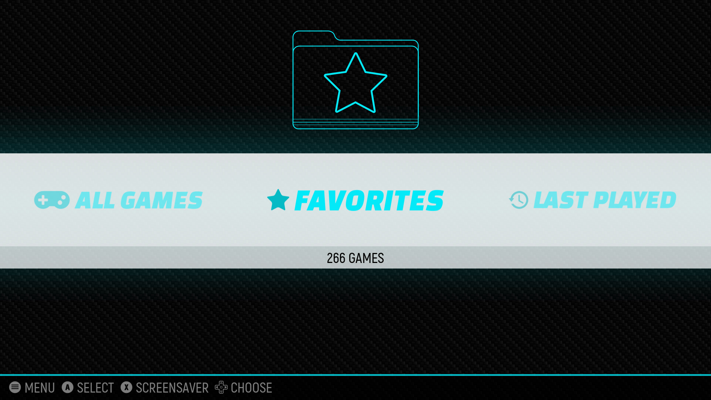
_System view, Teal color scheme_

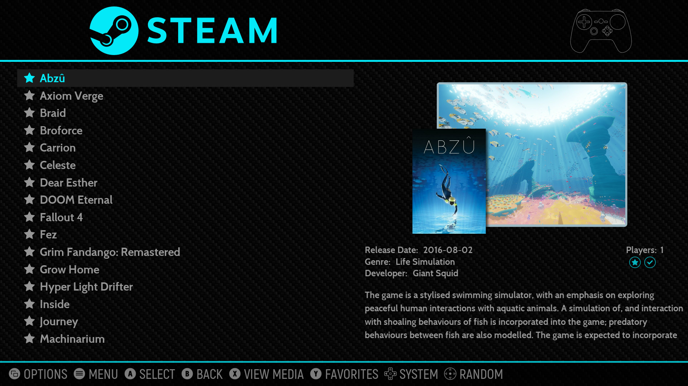
_Gamelist view, Teal color scheme_

---

### Cathode
https://github.com/hplant6/cathode-es-de

**Created by**\
Hplant6

**Variants**\
Carousels - 3D Box Art\
Carousels - Cover Image\
Carousel/System, Grid/Games\
Carousel/System, List/Games\
Grids\
Grid/System, Carousel Box/Games\
Grid/System, Carousel Cover/Games\
Grid/System, List/Games\
Lists\
List/System, Carousel Box/Games\
List/System, Carousel Cover/Games\
List/System, Grid/Games\
Low-end Devices

**Color schemes**\
Classic(Red)\
Classic(Red)[Images]\
Classic(Red)[No Videos]\
Classic(Red)[No Clock]\
Classic(Blue)\
Classic(Blue)[Images]\
Classic(Blue)[No Videos]\
Classic(Yellow)\
Classic(Yellow)[Images]\
Classic(Yellow)[No Videos]\
Cyber Neon\
Cyber Neon [Images]\
Cyber Neon [No Videos]\
Cyber Teal\
Cyber Teal [Images]\
Cyber Teal [No Videos]\
Resident Eerie\
Resident Eerie [Images]\
Resident Eerie [No Videos]\
Nautical\
Nautical [Images]\
Nautical [No Videos]\
Grape\
Grape [Images]\
Grape [No Videos]\
Gameboy\
Gameboy [Images]\
Gameboy [No Videos]\
Xbox Live\
Xbox Live [Images]\
Xbox Live [No Videos]\
Virtualboy\
Virtualboy [Images]\
Virtualboy [No Videos]\
Orange Phosphor\
Orange Phosphor [Images]\
Orange Phosphor [No Videos]

**Font sizes**\
Medium\
Large\
Small\
Extra large

**Aspect ratios**\
16:9\
16:10\
3:2\
4:3\
5:3 vertical\
21:9

**Transitions**\
Default\
Fading\
Instant\
Slide\
Fade

 color scheme")
_System view, Carousels - 3D Box Art variant, Classic(Red) color scheme_

 color scheme")
_Gamelist view, Carousels - 3D Box Art variant, Classic(Red) color scheme_

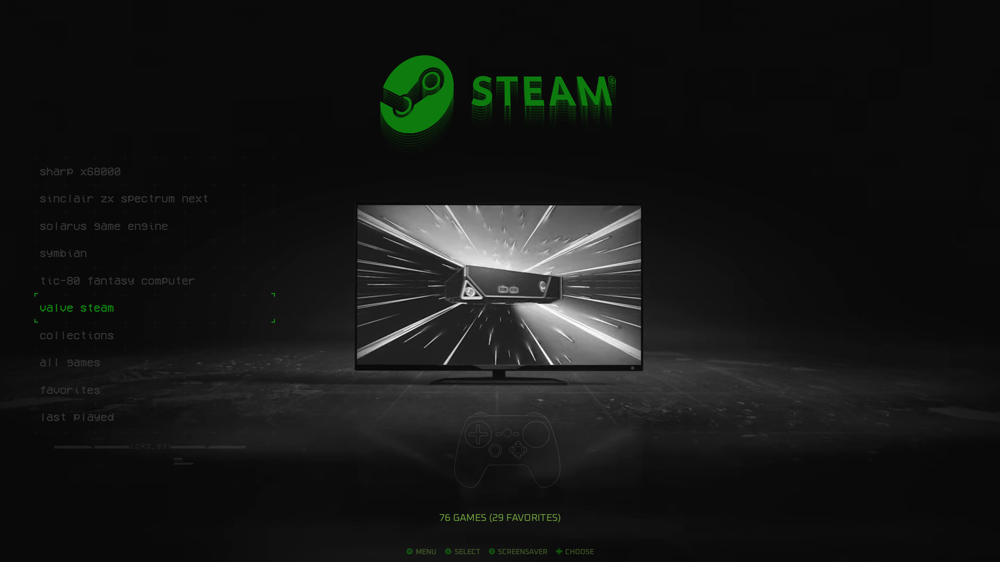
_System view, List/System, Grid/Games variant, Xbox Live color scheme_

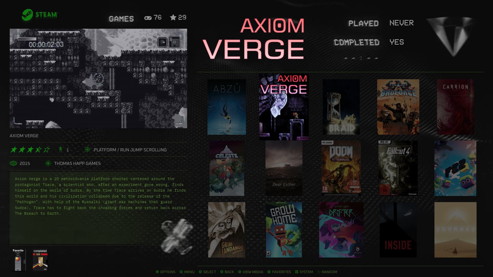
_Gamelist view, List/System, Grid/Games variant, Xbox Live color scheme_

---

### Catppuccin
https://github.com/RobZombie9043/catppuccin-es-de

**Created by**\
Rob Zombie

**Variants**\
[Grid] Grid\
[Grid] List: Basic\
[Grid] List: Detailed\
[List] Grid\
[List] List: Basic\
[List] List: Detailed

**Color schemes**\
Mocha\
Macchiato\
Frappé\
Latte

**Font sizes**\
Medium\
Large

**Aspect ratios**\
16:9\
16:10\
3:2\
4:3\
5:4\
8:7\
19.5:9\
21:9\
1:1

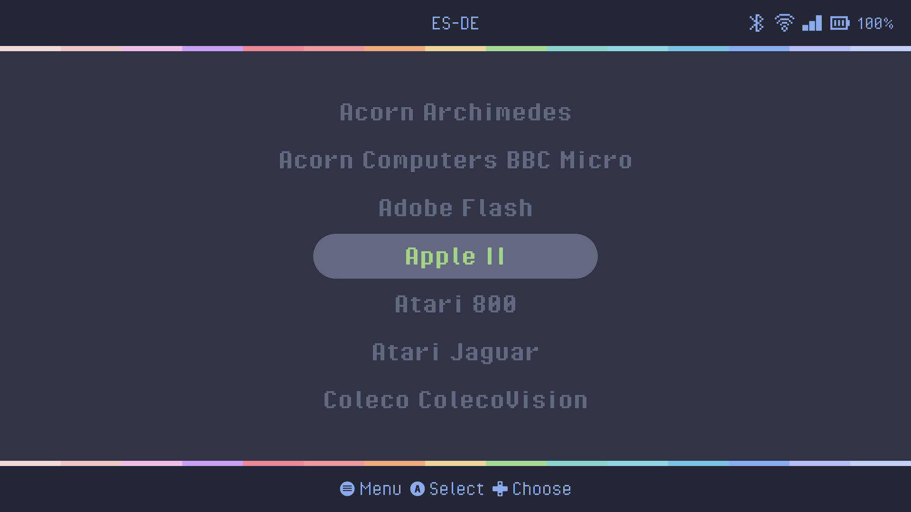
_System view, [List] Grid variant, Frappé color scheme_


_Gamelist view, [List] Grid variant, Frappé color scheme_


_System view, [List] Grid variant, Latte color scheme_


_Gamelist view, [List] Grid variant, Latte color scheme_

---

### Chicuelo (Revisited)
https://github.com/anthonycaccese/chicuelo-revisited-es-de

**Created by**\
ant and Chicuelo

**Variants**\
Artwork: Screenshots\
Artwork: Video\
Artwork: Chicuelo

**Aspect ratios**\
16:9\
16:10


_System view, Artwork: Chicuelo variant_


_System view, Artwork: Screenshots variant_


_Gamelist view_

---

### CodyWheel
https://github.com/Weestuarty-es-de/codywheel-es-de

**Created by**\
Weestuarty

**Variants**\
Text Gamelist\
Carousel Gamelist\
Grid Gamelist

**Color schemes**\
Black n White\
Gold\
Blue\
Gameboy\
Hitman\
Retro\
Stay Classy\
Black n Blue\
Chilled\
Purple Rain\
Rusty\
Sega\
PS2\
Neon Red\
Dark Void\
Choco-Banana\
Gotham Clown\
Sakura no Hana\
Clean Yellow\
Clean Red

**Font sizes**\
Medium\
Extra large

**Aspect ratios**\
16:9\
16:10\
4:3\
21:9

**Transitions**\
Instant w/Fade\
Instant

**Languages**\
English (United States)\
English (United Kingdom)\
Català\
Deutsch\
Español (España)\
Français\
Italiano\
Nederlands\
Polski\
Português (Brasil)\
Română\
Русский\
Svenska\
日本語\
한국어\
简体中文\
繁體中文


_System view, Black n White color scheme_


_Gamelist view, Text Gamelist variant, Black n White color scheme_


_System view, Blue color scheme_


_Gamelist view, Carousel Gamelist variant, Blue color scheme_


_System view, Purple Rain color scheme_


_Gamelist view, Grid Gamelist variant, Purple Rain color scheme_

---

### CoinOPS
https://github.com/TheGrizzMD/coinops-es-de

**Created by**\
TheGrizzMD, gjsmsmith, BritneysPAIRS and fagnerpc

**Variants**\
Default\
No Hue\
Simple\
Simple With Cover Art\
Default: Grid

**Aspect ratios**\
16:9\
16:10\
4:3\
19.5:9


_System view, Default variant_


_Gamelist view, Default variant_


_System view, Simple variant_


_Gamelist view, Simple variant_

---

### Colorful (Pop!)
https://github.com/RobZombie9043/colorful-pop-es-de

**Created by**\
Rob Zombie, ant and viking

**Variants**\
List (video)\
List (detailed)\
Carousel\
Carousel (video)

**Color schemes**\
[Pop Images] (Colorful) Light\
[Pop Images] (Colorful) Dark\
[Pop Images] (Colorful) Black\
[Pop Images] (Mono) Light\
[Pop Images] (Mono) Dark\
[Pop Images] (Mono) Black\
[Colorful Images] (Colorful) Light\
[Colorful Images] (Colorful) Dark\
[Colorful Images] (Colorful) Black\
[Colorful Images] (Mono) Light\
[Colorful Images] (Mono) Dark\
[Colorful Images] (Mono) Black

**Font sizes**\
Medium\
Large\
Small\
Extra large

**Aspect ratios**\
16:9\
16:10\
3:2\
4:3\
5:4\
19.5:9\
21:9

 variant, [Pop Images] (Colorful) Dark color scheme")
_System view, List (detailed) variant, [Pop Images] (Colorful) Dark color scheme_

 variant, [Pop Images] (Colorful) Dark color scheme")
_Gamelist view, List (detailed) variant, [Pop Images] (Colorful) Dark color scheme_

 variant, [Pop Images] (Colorful) Light color scheme")
_System view, List (video) variant, [Pop Images] (Colorful) Light color scheme_

 variant, [Pop Images] (Colorful) Light color scheme")
_Gamelist view, List (video) variant, [Pop Images] (Colorful) Light color scheme_

---

### Colorful (Revisited)
https://github.com/anthonycaccese/colorful-revisited-es-de

**Created by**\
ant and viking

**Color schemes**\
Light\
Dark\
Black

**Aspect ratios**\
16:9\
16:10


_System view, Light color scheme_


_Gamelist view, Light color scheme_


_System view, Dark color scheme_


_Gamelist view, Dark color scheme_

---

### Colorful (Simplified)
https://github.com/anthonycaccese/colorful-simplified-es-de

**Created by**\
ant and viking

**Variants**\
List: Boxart\
List: Miximage\
List: Screenshot\
List: Screenshot + Marquee\
List: Title Screen\
List: Physical Media\
List: Metadata & Boxart\
List: Metadata & Miximage\
List: Metadata & Screenshot\
List: Metadata & Screenshot + Marquee\
List: Metadata & Title Screen\
List: Metadata & Physical Media\
Carousel: Boxart

**Color schemes**\
Colorful\
Light\
Retro Bright\
DMG\
Dark\
OLED

**Font sizes**\
Medium\
Large

**Aspect ratios**\
16:9\
16:10\
4:3


_System view, List: Boxart variant, Colorful color scheme_


_Gamelist view, List: Miximage variant, Colorful color scheme_


_Gamelist view, Carousel: Boxart variant, Dark color scheme_

---

### Compendium
https://github.com/RobZombie9043/compendium-es-de

**Created by**\
Rob Zombie

**Variants**\
Screenshot\
Video (instant)\
Video (delay)

**Color schemes**\
Dracula\
Alucard

**Font sizes**\
Medium\
Large\
Small

**Aspect ratios**\
16:9\
16:10\
3:2\
4:3\
5:4\
8:7\
19.5:9\
21:9\
32:9\
1:1


_System view, Screenshot variant, Dracula color scheme_


_Gamelist view, Screenshot variant, Dracula color scheme_

 variant, Alucard color scheme")
_System view, Video (instant) variant, Alucard color scheme_

 variant, Alucard color scheme")
_Gamelist view, Video (instant) variant, Alucard color scheme_

---

### DEcaffe
https://github.com/Weestuarty-es-de/decaffe-es-de

**Created by**\
Weestuarty

**Variants**\
Solid w Meta\
Solid w/o Meta\
Color w Meta\
Color w/o Meta

**Color schemes**\
Blue dark\
Yellow\
Classy\
Hyrule\
Blue light\
Purple\
Greyscale

**Font sizes**\
Medium\
Large\
Extra large

**Aspect ratios**\
16:9\
16:10\
4:3\
19.5:9\
21:9

**Transitions**\
Instant w/Fade\
Instant

**Languages**\
English (United States)\
English (United Kingdom)\
Bosanski\
Català\
Deutsch\
Español (España)\
Français\
Hrvatski\
Italiano\
Nederlands\
Polski\
Português (Brasil)\
Português (Portugal)\
Română\
Русский\
Srpski\
Svenska\
日本語\
한국어\
简体中文\
繁體中文


_System view, Solid w Meta variant, Blue light color scheme_


_Gamelist view, Solid w Meta variant, Blue light color scheme_

---

### Diamond
https://github.com/Weestuarty-es-de/diamond-es-de

**Created by**\
Weestuarty and GreatFlash

**Variants**\
Color w/ text alt\
Color w/ text gamelist\
Color w/ grid gamelist\
Solid w/ text alt\
Solid w/ text gamelist\
Solid w/ grid gameslist

**Color schemes**\
Blue dark\
Yellow\
Classy\
Hyrule\
Blue light\
Purple\
Greyscale

**Font sizes**\
Medium\
Large\
Extra large

**Aspect ratios**\
16:9\
16:10\
4:3\
21:9

**Transitions**\
Slide\
Instant

**Languages**\
English (United States)\
English (United Kingdom)\
Bosanski\
Català\
Deutsch\
Español (España)\
Français\
Hrvatski\
Italiano\
Nederlands\
Polski\
Português (Brasil)\
Português (Portugal)\
Română\
Русский\
Srpski\
Svenska\
日本語\
한국어\
简体中文\
繁體中文


_System view, Color w/ text alt variant, Classy color scheme_


_Gamelist view, Color w/ text alt variant, Classy color scheme_


_System view, Color w/ text gamelist variant, Blue dark color scheme_


_Gamelist view, Color w/ text gamelist variant, Blue dark color scheme_

---

### DS
https://github.com/Weestuarty-es-de/ds-es-de

**Created by**\
Weestuarty

**Variants**\
Grid\
Carousel\
R4

**Color schemes**\
DS\
DS Dark\
NES\
Famicom\
Gold\
OLED\
Blueprint

**Font sizes**\
Medium\
Large

**Aspect ratios**\
16:9\
16:10\
4:3\
19.5:9\
1:1

**Transitions**\
Instant\
Slide\
Fade

**Languages**\
English (United States)\
English (United Kingdom)\
Bosanski\
Català\
Deutsch\
Español (España)\
Français\
Hrvatski\
Italiano\
Nederlands\
Polski\
Português (Brasil)\
Português (Portugal)\
Română\
Русский\
Srpski\
Svenska\
日本語\
한국어\
简体中文\
繁體中文


_System view, Grid variant, DS color scheme_


_Gamelist view, Grid variant, DS color scheme_


_System view, Carousel variant, Blueprint color scheme_


_Gamelist view, Carousel variant, Blueprint color scheme_

---

### Elegance
https://github.com/Weestuarty-es-de/elegance-es-de

**Created by**\
Weestuarty

**Variants**\
Solid with Videos\
Solid no Videos\
Color with Videos\
Color no Videos

**Color schemes**\
Yellow\
Classy\
Hyrule\
White/Blue\
Grey/Blue\
Grey/Purple\
White/Red

**Aspect ratios**\
16:9\
16:10\
4:3\
21:9

**Transitions**\
Instant w/Fade\
Instant

**Languages**\
English (United States)\
English (United Kingdom)\
Bosanski\
Català\
Deutsch\
Español (España)\
Français\
Hrvatski\
Italiano\
Nederlands\
Polski\
Português (Brasil)\
Português (Portugal)\
Română\
Русский\
Srpski\
Svenska\
日本語\
한국어\
简体中文\
繁體中文


_System view, Yellow color scheme_


_Gamelist view, Solid with Videos variant, Yellow color scheme_

---

### Elementerial
https://github.com/RobZombie9043/elementerial-es-de

**Created by**\
Rob Zombie and mluizvitor

**Variants**\
[Modern] List: Basic View\
[Modern] List: Video View\
[Modern] List: Detailed View\
[Modern] Elementflix View\
[Modern] Grid View (Small)\
[Modern] Grid View (Large)\
[Classic] List: Basic View\
[Classic] List: Video View\
[Classic] List: Detailed View\
[Classic] Elementflix View\
[Classic] Grid View (Small)\
[Classic] Grid View (Large)\
[Video] List: Basic View\
[Video] List: Video View\
[Video] List: Detailed View\
[Video] Elementflix View\
[Video] Grid View (Small)\
[Video] Grid View (Large)

**Color schemes**\
Dark - Strawberry\
Dark - Orange\
Dark - Banana\
Dark - Lime\
Dark - Mint\
Dark - Blueberry\
Dark - Grape\
Dark - Bubblegum\
Dark - Cocoa\
Dark - Slate\
Dark - SNES\
Dark - Gameboy\
Dark - Pikachu Edition\
Dark - Red Fruits\
Light - Strawberry\
Light - Orange\
Light - Banana\
Light - Lime\
Light - Mint\
Light - Blueberry\
Light - Grape\
Light - Bubblegum\
Light - Cocoa\
Light - Slate\
Light - SNES\
Light - Gameboy\
Light - Pikachu Edition\
Light - Red Fruits

**Font sizes**\
Medium\
Large\
Small

**Aspect ratios**\
16:9\
16:10\
3:2\
4:3\
5:4\
19.5:9\
21:9\
1:1


_System view, [Modern] Elementflix View variant, Dark - Lime color scheme_


_Gamelist view, [Modern] Elementflix View variant, Dark - Lime color scheme_


_System view, [Classic] List: Video View variant, Light - Banana color scheme_


_Gamelist view, [Classic] List: Video View variant, Light - Banana color scheme_

---

### Epic Noir (Next)
https://github.com/anthonycaccese/epic-noir-next-es-de

**Created by**\
ant and Chicuelo

**Variants**\
Grid: Marquees\
Grid: Screenshots\
Grid: Physical Media\
Grid: Covers\
Grid: Title Screens\
Grid: No Metadata

**Aspect ratios**\
16:9\
16:10


_System view_


_Gamelist view, Grid: Marquees variant_


_Gamelist view, Grid: Physical Media variant_


_Gamelist view, Grid: Title Screens variant_

---

### Epic Noir (Revisited)
https://github.com/anthonycaccese/epic-noir-revisited-es-de

**Created by**\
ant, dragoonDorise, c64-dev and Chicuelo

**Aspect ratios**\
16:9\
16:10


_System view_


_Gamelist view_

---

### ES-Boy
https://github.com/Weestuarty-es-de/esboy-es-de

**Created by**\
Weestuarty

**Variants**\
Textlist with videos\
Textlist without videos

**Color schemes**\
Green\
Grey\
Gold

**Font sizes**\
Medium\
Large\
Extra large

**Aspect ratios**\
16:9\
16:10\
4:3\
19.5:9\
21:9

**Transitions**\
Instant\
Slide\
Fade

**Languages**\
English (United States)\
English (United Kingdom)\
Bosanski\
Català\
Deutsch\
Español (España)\
Français\
Hrvatski\
Italiano\
Nederlands\
Polski\
Português (Brasil)\
Português (Portugal)\
Română\
Русский\
Srpski\
Svenska\
日本語\
한국어\
简体中文\
繁體中文


_System view, Textlist with videos variant, Gold color scheme_


_Gamelist view, Textlist with videos variant, Gold color scheme_


_System view, Textlist with videos variant, Green color scheme_


_Gamelist view, Textlist with videos variant, Green color scheme_

---

### ES-DE-Mini
https://github.com/Weestuarty-es-de/mini-es-de

**Created by**\
Weestuarty

**Variants**\
Super Nintendo (List)\
UsnesA UsnesA (List)\
Nintendo (List)\
Mega Drive (List)\
Master System (List)\
PlayStation (List)\
Super Nintendo (Grid)\
UsnesA UsnesA (Grid)\
Nintendo (Grid)\
Mega Drive (Grid)\
Master System (Grid)\
PlayStation (Grid)

**Color schemes**\
SNES\
USNESA\
NES\
Famicon\
Sega\
Master System\
Hystoria\
Hystoria ALT\
Limited Edition\
Its a Mario\
Mrs LEphant\
Gold

**Font sizes**\
Medium\
Large\
Extra large

**Aspect ratios**\
16:9\
16:10\
4:3\
21:9

**Transitions**\
Instant w/Fade\
Instant

**Languages**\
English (United States)\
English (United Kingdom)\
Bosanski\
Català\
Deutsch\
Español (España)\
Français\
Hrvatski\
Italiano\
Nederlands\
Polski\
Português (Brasil)\
Português (Portugal)\
Română\
Русский\
Srpski\
Svenska\
日本語\
한국어\
简体中文\
繁體中文

 variant, NES color scheme")
_System view, Nintendo (List) variant, NES color scheme"_

 variant, NES color scheme")
_Gamelist view, Nintendo (List) variant, NES color scheme_

 variant, USNESA color scheme")
_System view, PlayStation (List) variant, USNESA color scheme_

 variant, USNESA color scheme")
_Gamelist view, PlayStation (List) variant, USNESA color scheme_

 variant, SNES color scheme")
_System view, Super Nintendo (Grid) variant, SNES color scheme_

 variant, SNES color scheme")
_Gamelist view, Super Nintendo (Grid) variant, SNES color scheme_

---

### ES-DWEE
https://github.com/Weestuarty-es-de/es-dwee-es-de

**Created by**\
Weestuarty

**Variants**\
Textlist\
Fullscreen\
Grid

**Color schemes**\
Blue\
Gold\
Cube\
Rose\
Famiwii\
Retro\
Retro Power\
RetroDECK\
Gameboy

**Font sizes**\
Medium\
Large\
Extra large

**Aspect ratios**\
16:9\
16:10\
4:3\
19.5:9\
21:9

**Transitions**\
Slide\
Instant

**Languages**\
English (United States)\
English (United Kingdom)\
Bosanski\
Català\
Deutsch\
Español (España)\
Français\
Hrvatski\
Italiano\
Nederlands\
Polski\
Português (Brasil)\
Português (Portugal)\
Română\
Русский\
Srpski\
Svenska\
العربية\
日本語\
한국어\
简体中文\
繁體中文


_System view, Blue color scheme_


_Gamelist view, Textlist variant, Blue color scheme_

---

### Escape
https://github.com/RobZombie9043/escape-es-de

**Created by**\
Rob Zombie

**Variants**\
[Animated] Watchtower Distant\
[Animated] Lakeside\
[Animated] Watchtower Close-Up\
[Animated] Monado\
[Animated] Outset Island\
[Still] Watchtower Distant\
[Still] Lakeside\
[Still] Watchtower Close-Up\
[Still] Monado\
[Still] Outset Island

**Color schemes**\
Dawn\
Sunrise\
Early Morning\
Day\
Golden Hour\
Sunset\
Dusk\
Night

**Font sizes**\
Medium\
Large\
Small

**Aspect ratios**\
16:9\
16:10\
3:2\
4:3\
5:4\
19.5:9\
21:9\
32:9\
1:1

**Languages**\
English (United States)\
English (United Kingdom)\
Català\
Deutsch\
Español (España)\
Français\
Italiano\
Nederlands\
Polski\
Português (Brasil)\
Română\
Русский\
Svenska\
日本語\
한국어\
简体中文\
繁體中文


_System view, [Animated] Watchtower Distant variant, Sunset color scheme_


_Gamelist view, [Animated] Watchtower Distant variant, Night color scheme_


_System view, [Animated] Lakeside variant, Sunset color scheme_


_Gamelist view, [Animated] Lakeside variant, Night color scheme_

---

### ForAll
https://github.com/Weestuarty-es-de/forall-es-de

**Created by**\
Weestuarty

**Variants**\
Dyslexia w videos\
Dyslexia w/o videos\
Impaired w videos\
Impaired w/o videos

**Color schemes**\
Mono\
Mono Variant\
IBM\
IBM Variant\
Bang Wong\
Bang Wong Variant\
Paul Tol\
Paul Tol Variant

**Aspect ratios**\
16:9\
16:10\
4:3\
21:9

**Transitions**\
Instant w/Fade\
Instant

**Languages**\
English (United States)\
English (United Kingdom)\
Bosanski\
Català\
Deutsch\
Español (España)\
Français\
Hrvatski\
Italiano\
Nederlands\
Polski\
Português (Brasil)\
Português (Portugal)\
Română\
Русский\
Srpski\
Svenska\
日本語\
한국어\
简体中文\
繁體中文


_System view, Impaired w videos variant, Bang Wong color scheme_


_Gamelist view, Impaired w videos variant, Bang Wong color scheme_


_System view, Dyslexia w videos variant, Paul Tol Variant color scheme_


_Gamelist view, Dyslexia w videos variant, Paul Tol Variant color scheme_

---

### Game OS
https://github.com/lilbud/gameos-es-de

**Created by**\
lilbud and PlayingKarrde

**Variants**\
Default\
Grid (3 Columns)\
Grid (4 Columns)\
Grid (5 Columns)\
Grid (6 Columns)\
Grid (7 Columns)\
Grid (8 Columns)

**Color schemes**\
Game OS\
Dark OS Blue\
Dark OS Brown\
Dark OS Gray\
Dark OS Green\
Dark OS Pink\
Dark OS Red\
Dark OS Light Blue\
Dark OS Light Brown\
Dark OS Light Gray\
Dark OS Light Green\
Dark OS Light Pink\
Dark OS Light Red\
Dark OS Magenta\
Dark OS Orange\
Dark OS Purple\
Dark OS Steel\
Dark OS Stone\
Dark OS Turquoise\
Dark OS Yellow

**Font sizes**\
Medium\
Large

**Aspect ratios**\
16:9\
4:3


_System view, Game OS color scheme_


_Gamelist view, Default variant, Game OS color scheme_


_System view, Dark OS Light Brown color scheme_

 variant, Dark OS Light Brown color scheme")
_Gamelist view, Grid (4 Columns) variant, Dark OS Light Brown color scheme_

---

### Grimmlex
https://gitlab.com/thraeg-group/grimmlex-es-de

**Created by**\
Thraeg

**Variants**\
[LogoGrid] M\
[LogoGrid] S\
[LogoGrid] L\
[LogoGrid] XL\
[LogoGrid] XXL\
[WordGrid] S\
[WordGrid] M\
[WordGrid] L\
[WordGrid] XL\
[WordGrid] XXL\
[PixelGrid] S\
[PixelGrid] M\
[PixelGrid] L\
[PixelGrid] XL\
[PixelGrid] XXL

**Color schemes**\
Dark (OLED)\
Dark\
Light

**Font sizes**\
Medium\
Large\
Small\
Extra large

**Aspect ratios**\
16:9\
16:10\
3:2\
4:3\
5:3\
5:4\
8:7\
19.5:9\
20:9\
21:9\
32:9\
1:1

**Transitions**\
Instant and Slide\
Instant


_System view, [PixelGrid] XL variant, Light color scheme_


_Gamelist view, [PixelGrid] XL variant, Light color scheme_


_System view, [LogoGrid] L variant, Dark color scheme_


_Gamelist view, [LogoGrid] L variant, Dark color scheme_

---

### Homage
https://github.com/Weestuarty-es-de/homage-es-de

**Created by**\
Weestuarty

**Variants**\
Mask w Textlist\
Mask w Grid\
No Mask w Textlist\
No Mask w Grid\
Mask w Textlist w/systemcol\
Mask w Grid w/systemcol\
No Mask w Textlist w/systemcol\
No Mask w Grid w/systemcol

**Color schemes**\
Universe\
Vintage\
Retro\
Smoke

**Font sizes**\
Medium\
Large\
Extra large

**Aspect ratios**\
16:9\
16:10\
4:3\
19.5:9

**Transitions**\
Instant w/Fade\
Instant

**Languages**\
English (United States)\
English (United Kingdom)\
Bosanski\
Català\
Deutsch\
Español (España)\
Français\
Hrvatski\
Italiano\
Nederlands\
Polski\
Português (Brasil)\
Português (Portugal)\
Română\
Русский\
Srpski\
Svenska\
日本語\
한국어\
简体中文\
繁體中文


_System view, Mask w Textlist variant, Universe color scheme_


_Gamelist view, Mask w Textlist variant, Universe color scheme_


_System view, No Mask w Grid variant, Vintage color scheme_


_Gamelist view, No Mask w Grid variant, Vintage color scheme_

---

### Horizon
https://github.com/RobZombie9043/horizon-es-de

**Created by**\
Rob Zombie

**Variants**\
List: Detailed\
List: Basic\
Grid (Small): Detailed\
Grid (Small): Basic\
Grid (Medium): Detailed\
Grid (Medium): Basic\
Grid (Large): Detailed\
Grid (Large): Basic\
Carousel

**Color schemes**\
Default\
Custom

**Font sizes**\
Medium\
Large\
Extra large

**Aspect ratios**\
16:9\
16:10\
3:2\
4:3\
5:4\
19.5:9\
21:9\
32:9\
1:1


_System view, Carousel variant_


_Gamelist view, Carousel variant_


_System view, List: Basic variant_


_Gamelist view, List: Basic variant_

---

### Iconic
https://github.com/Siddy212/iconic-es-de

**Created by**\
Siddy212 and Matt S

**Variants**\
Textlist\
Textlist - Flipped\
Carousel\
Grid: Boxart\
Grid: Physical Media\
Grid: Titlescreen\
Grid: Marquee\
[Simple] Textlist\
[Simple] Carousel\
[Simple] Grid: Boxart\
[Simple] Grid: Physical Media

**Color schemes**\
Default - Light\
Default - Dark\
Default - Retro Gray\
Classic - Light\
Classic - Dark\
Classic - Retro Gray\
Modern - Light\
Modern - Dark\
Modern - Retro Gray\
Last Played - Light\
Last Played - Dark\
Last Played - Retro Gray\
Custom - Light\
Custom - Dark\
Custom - Retro Gray

**Font sizes**\
Medium\
Large\
Small\
Extra large

**Aspect ratios**\
16:9\
16:10\
3:2\
4:3\
8:7\
19.5:9\
21:9\
1:1


_System view, Modern - Light color scheme_


_Gamelist view, Textlist variant, Modern - Light color scheme_


_Gamelist view, Grid: Boxart variant, Classic - Dark color scheme_


_Gamelist view, Grid: Titlescreen variant, Classic - Dark color scheme_

---

### iiSU Interpreted
https://github.com/MrVictorFull57/iisu-interpreted-es-de

**Created by**\
MrVictorFull and UsagiShade

**Variants**\
Default\
Without Controller Icons\
Without Clock\
Without Either\
Grid\
Grid Without Either

**Color schemes**\
Light\
Dark\
Blue\
Grean\
Teal

**Aspect ratios**\
16:9\
16:10\
4:3\
8:7\
19.5:9\
21:9

**Languages**\
English (United States)\
English (United Kingdom)\
Bosanski\
Català\
Deutsch\
Español (España)\
Français\
Hrvatski\
Italiano\
Nederlands\
Polski\
Português (Brasil)\
Português (Portugal)\
Română\
Русский\
Srpski\
Svenska\
日本語\
한국어\
简体中文\
繁體中文


_System view, Default variant, Light color scheme_


_Gamelist view, Default variant, Light color scheme_


_System view, Without Clock variant, Dark color scheme_


_Gamelist view, Without Clock variant, Dark color scheme_

---

### Immersive (Revisited)
https://github.com/anthonycaccese/immersive-revisited-es-de

**Created by**\
ant

**Variants**\
Background Screenshot\
Background Video

**Aspect ratios**\
16:9\
16:10\
4:3


_System view_


_Gamelist view, Background Screenshot variant_


_Gamelist view, Background Video variant_

---

### Mania Menu
https://github.com/anthonycaccese/mania-menu-es-de

**Created by**\
ant

**Variants**\
Video\
Screenshot\
Fanart\
Custom

**Color schemes**\
Yellow\
Blue\
Purple

**Aspect ratios**\
16:9\
16:10\
4:3


_System view, Screenshot variant, Yellow color scheme_


_Gamelist view, Fanart variant, Yellow color scheme_


_Gamelist view, Screenshot variant, Blue color scheme_

---

### Meringue
https://github.com/kthod861/meringue-es-de

**Created by**\
K_thod

**Variants**\
Grid: Small\
Grid: Medium\
Grid: Large\
Grid: Extra large

**Font sizes**\
Medium\
Large\
Small

**Aspect ratios**\
16:9\
16:10\
3:2\
4:3\
5:3 vertical\
21:9\
1:1


_System view, Grid: Small variant_


_Gamelist view, Grid: Small variant_


_System view, Grid: Large variant_


_Gamelist view, Grid: Large variant_

---

### MinUI Menu
https://github.com/anthonycaccese/minui-menu-es-de

**Created by**\
ant and Shaun Inman

**Variants**\
List\
List: Boxart\
List: Screenshot\
List: Title Screen\
List: Physical Media\
List: Miximage

**Color schemes**\
Dark (Bold Font)\
Light (Bold Font)\
Dark (Normal Font)\
Light (Normal Font)\
Pocket DMG\
Pocket Micro\
Pocket Ace (Dark)\
Pocket Ace (Light)\
Pocket Ace (Retro)\
Amber Terminal\
Green Terminal\
Cyberpunk\
Fallout\
Game Boy DMG\
Custom

**Font sizes**\
Medium\
Large\
Small\
Extra large\
Extra small

**Aspect ratios**\
16:9\
16:10\
3:2\
4:3\
5:3 vertical\
19.5:9\
1:1

**Transitions**\
Instant\
Slide


_System view, List: Boxart variant, Pocket Micro color scheme_


_Gamelist view, List: Boxart variant, Pocket Micro color scheme_

 color scheme")
_System view, List variant, Light (Bold Font) color scheme_

 color scheme")
_Gamelist view, List variant, Light (Bold Font) color scheme_


_System view, List: Boxart variant, Cyberpunk color scheme_


_Gamelist view, List: Boxart variant, Cyberpunk color scheme_

---

### MiSTer Menu
https://github.com/anthonycaccese/mister-menu-es-de

**Created by**\
ant

**Variants**\
Screenshots Off\
Screenshots On

**Color schemes**\
Crisp Mountain Air\
Test Pattern\
Pocky & Rocky\
Custom

**Aspect ratios**\
16:9\
16:10\
4:3


_System view, Crisp Mountain Air color scheme_


_Gamelist view, Screenshots Off variant, Test Pattern color scheme_


_Gamelist view, Screenshots On variant_

---

### Modern
https://gitlab.com/es-de/themes/modern-es-de \
_This theme is bundled with ES-DE on all platforms except Android_

**Created by**\
Sophia Hadash and lilbud

**Variants**\
Textlist with videos\
Textlist without videos\
Textlist with videos (legacy)\
Textlist without videos (legacy)

**Color schemes**\
Dark\
Light

**Font sizes**\
Medium\
Large

**Aspect ratios**\
16:9\
16:10\
4:3\
21:9

**Transitions**\
Instant\
Instant and slide\
Instant and fade

**Languages**\
English (United States)\
English (United Kingdom)\
Bosanski\
Català\
Deutsch\
Español (España)\
Français\
Hrvatski\
Italiano\
Nederlands\
Polski\
Português (Brasil)\
Português (Portugal)\
Română\
Русский\
Srpski\
Svenska\
Tiếng việt\
العربية\
日本語\
한국어\
简体中文\
繁體中文


_System view, Textlist with videos variant, Dark color scheme_


_Gamelist view, Textlist with videos variant, Dark color scheme_


_System view, Textlist with videos variant, Light color scheme_


_Gamelist view, Textlist with videos variant, Light color scheme_

 variant, Dark color scheme")
_System view, Textlist with videos (legacy) variant, Dark color scheme_

 variant, Light color scheme")
_System view, Textlist with videos (legacy) variant, Light color scheme_

---

### Notepad Pocket
https://github.com/anthonycaccese/notepad-pocket-es-de

**Created by**\
Zoidburg and ant

**Variants**\
Polaroid: Screenshot\
Polaroid: Fanart\
Polaroid: Title Screen

**Color schemes**\
Walnut\
Carpet\
Purple\
Cutting Mat

**Font sizes**\
Medium\
Large\
Small

**Aspect ratios**\
16:9\
16:10\
4:3\
19.5:9\
1:1

**Transitions**\
Instant\
Slide


_System view, Polaroid: Screenshot variant, Walnut color scheme_


_Gamelist view, Polaroid: Screenshot variant, Walnut color scheme_


_System view, Polaroid: Title Screen variant, Carpet color scheme_


_Gamelist view, Polaroid: Title Screen variant, Carpet color scheme_

---

### NSO Menu (Interpreted)
https://github.com/anthonycaccese/nso-menu-interpreted-es-de

**Created by**\
ant and rog

**Variants**\
Grid: Boxart\
Grid: Boxart (SteamGridDB)

**Color schemes**\
Default [Controllers]\
Default [Controllers + Screenshots]\
Default [Colorful]\
Default [Colorful + Screenshots]\
Default [Logos + Screenshots]\
Default [Logos + Fanart]\
Default [Screenshots]\
Default [Fanart]\
Custom

**Font sizes**\
Medium\
Large

**Aspect ratios**\
16:9\
16:10\
4:3\
8:7\
1:1


_System view, Grid: Boxart variant, Default [Controllers] color scheme_


_System view, Grid: Boxart variant, Default [Controllers + Screenshots] color scheme_


_Gamelist view, Grid: Boxart variant, Default [Controllers] color scheme_


_Gamelist view, Grid: Boxart variant, Default [Controllers] color scheme_

---

### P-10 Menu
https://github.com/anthonycaccese/p-10-menu-es-de

**Created by**\
ant

**Variants**\
List\
List + Boxart

**Color schemes**\
Playchoice\
Light Blue\
Capcom Purple\
Retro Gray\
Dark Tan\
OLED\
Light\
Custom

**Aspect ratios**\
16:9\
16:10\
3:2\
4:3\
19.5:9\
1:1


_System view, Playchoice color scheme_


_Gamelist view, List variant, Playchoice color scheme_


_System view, Capcom Purple color scheme_


_Gamelist view, List + Boxart variant, Capcom Purple color scheme_

---

### PlayStation-X
https://github.com/RobZombie9043/playstation-x-es-de

**Created by**\
Rob Zombie and pajarorrojo

**Variants**\
Carousel (Basic)\
Carousel (Immersive)\
Carousel (Detailed)\
Grid\
Textlist

**Color schemes**\
PS4\
PS4 (No system videos)\
PS4 (Custom)\
PS5\
PS5 (No system videos)\
PS5 (Custom)

**Font sizes**\
Medium\
Large\
Small

**Aspect ratios**\
16:9\
16:10\
3:2\
4:3\
5:4\
8:7\
19.5:9\
21:9\
32:9\
1:1

**Languages**\
English (United States)\
English (United Kingdom)\
Bosanski\
Català\
Deutsch\
Español (España)\
Français\
Hrvatski\
Italiano\
Nederlands\
Polski\
Português (Brasil)\
Português (Portugal)\
Română\
Русский\
Srpski\
Svenska\
العربية\
日本語\
한국어\
简体中文\
繁體中文

 variant, PS5 color scheme")
_System view, Carousel (Detailed) variant, PS5 color scheme_

 variant, PS5 color scheme")
_Gamelist view, Carousel (Detailed) variant, PS5 color scheme_


_System view, Grid variant, PS4 color scheme_


_Gamelist view, Grid variant, PS4 color scheme_

---

### PS5 Menu
https://github.com/InitialDin/ps5-menu-es-de

**Created by**\
InitialDin

**Variants**\
PS5 (Small)\
PS5 (Large)\
PS5 (Small) + XMB (Cover)\
PS5 (Small) + XMB (Minimal)\
PS5 (Small) + XMB (Marquee)\
PS5 (Small) + XMB (Title Screen)\
PS5 (Small) + XMB (Physical Media)\
PS5 (Large) + XMB (Cover)\
PS5 (Large) + XMB (Minimal)\
PS5 (Large) + XMB (Marquee)\
PS5 (Large) + XMB (Title Screen)\
PS5 (Large) + XMB (Physical Media)

**Color schemes**\
Media - Video\
Media - Screenshot\
Media - Mix Image\
Media - Video (Audio Only)\
Media - Video (Audio Only + Screenshot)\
Media - Video (Audio Only + Mix Image)\
Background Video\
Background Video (Screenshot)\
Background Video (Mix Image)\
No Media

**Aspect ratios**\
16:9\
16:10\
3:2\
4:3\
20:9

 variant, Media - Video color scheme")
_System view, PS5 (Small) variant, Media - Video color scheme_

 variant, Media - Video color scheme")
_Gamelist view, PS5 (Small) variant, Media - Video color scheme_

 variant, Background Video color scheme")
_System view, PS5 (Large) variant, Background Video color scheme_

 variant, Background Video color scheme")
_Gamelist view, PS5 (Large) variant, Background Video color scheme_

---

### Razor
https://github.com/Weestuarty-es-de/razor-es-de

**Created by**\
Weestuarty

**Variants**\
GB w/Metadata(no color)\
Alt w/Metadata(no color)\
LCD w/Metadata(no color)\
GB w/o Metadata (no color)\
Alt w/o Metadata (no color)\
LCD w/o Metadata (no color)\
GB w/Metadata\
LCD w/Metadata\
Alt w/Metadata\
GB w/o Metadata\
LCD w/o Metadata\
Alt w/o Metadata

**Color schemes**\
Game & Watch\
Gameboy\
Classy\
Blue LCD\
Dark\
Yellow

**Font sizes**\
Medium\
Large\
Extra large

**Aspect ratios**\
16:9\
16:10\
4:3\
21:9

**Transitions**\
Instant\
Instant and slide\
Instant and fade

**Languages**\
English (United States)\
English (United Kingdom)\
Bosanski\
Català\
Deutsch\
Español (España)\
Français\
Hrvatski\
Italiano\
Nederlands\
Polski\
Português (Brasil)\
Português (Portugal)\
Română\
Русский\
Srpski\
Svenska\
日本語\
한국어\
简体中文\
繁體中文


_System view, GB w/o Metadata variant, Classy color scheme_


_Gamelist view, GB w/o Metadata variant, Classy color scheme_


_System view, LCD w/Metadata variant, Gameboy color scheme_


_Gamelist view, LCD w/Metadata variant, Gameboy color scheme_


_System view, GB w/Metadata variant, Dark color scheme_


_Gamelist view, GB w/Metadata variant, Dark color scheme_

---

### Retro Mega (Revisited)
https://github.com/anthonycaccese/retromega-revisited-es-de

**Created by**\
ant and djfumberger

**Variants**\
List: Boxart\
List: Miximage\
List: Screenshot\
List: Title Screen\
List: Physical Media\
Carousel: Boxart\
Basic

**Color schemes**\
Colorful (Light)\
Colorful (Dark)\
DMG\
Famicom\
Indigo (Light)\
Indigo (Dark)\
Retro

**Font sizes**\
Medium\
Small

**Aspect ratios**\
16:9\
16:10\
3:2\
4:3\
19.5:9\
21:9

**Transitions**\
Slide\
Instant + Slide\
Instant

 color scheme")
_System view, List: Boxart variant, Colorful (Light) color scheme_

 color scheme")
_Gamelist view, List: Boxart variant, Colorful (Light) color scheme_


_System view, List: Title Screen variant, Famicom color scheme_


_Gamelist view, List: Title Screen variant, Famicom color scheme_

---

### Retrofix (Revisited)
https://github.com/anthonycaccese/retrofix-revisited-es-de

**Created by**\
ant and 20GotoTen

**Variants**\
Immersive\
Simple\
Carousel\
Grid

**Aspect ratios**\
16:9\
16:10


_System view_


_Gamelist view, Immersive variant_


_Gamelist view, Simple variant_


_Gamelist view, Carousel variant_


_Gamelist view, Grid variant_

---

### Saga Diamond
https://github.com/Jetup13/sagadiamond-es-de

**Created by**\
Jetup

**Variants**\
Default\
w/ Videos\
w/ Videos & w/o Shadow\
w/ Videos & w/o Shadow/Metadata\
w/o System Metadata\
w/o Shadow\
w/o System Metadata & Shadow

**Color schemes**\
White\
Charcoal\
Lavender\
Mint\
Lime Green\
Baby Blue\
Sky Blue\
Ocean Blue\
Lemon Yellow\
Butter Yellow\
Peach\
Orange\
Burnt Orange\
Cardinal Red\
Strawberry\
Dark Raspberry\
Fuchsia Pink\
Amethyst\
Grape\
Per Console

**Font sizes**\
Medium\
Large

**Aspect ratios**\
16:9\
16:10\
4:3\
19.5:9\
21:9\
1:1

**Transitions**\
Instant\
Slide\
Fade

**Languages**\
English (United States)\
Español (España)\
Français\
Italiano\
Polski\
Português (Brasil)\
Română\
Русский\
Svenska\
日本語\
简体中文


_System view, Default variant, White color scheme_


_Gamelist view, Default variant, White color scheme_


_System view, w/o System Metadata & Shadow variant, Orange color scheme_


_Gamelist view, w/o System Metadata & Shadow variant, Orange color scheme_

---

### shinretro (Revisited)
https://github.com/RobZombie9043/shinretro-revisited-es-de

**Created by**\
Rob Zombie and ant

**Variants**\
Grid\
Carousel

**Color schemes**\
Dark\
Light\
SteamOS\
shinretro Dark\
Custom - Dark\
Custom - Light\
Custom - SteamOS\
Custom - shinretro Dark

**Font sizes**\
Medium\
Large

**Aspect ratios**\
16:9\
16:10\
4:3\
19.5:9\
1:1


_System view, Grid variant, SteamOS color scheme_


_Gamelist view, Grid variant, SteamOS color scheme_


_System view, Carousel variant, shinretro Dark color scheme_


_Gamelist view, Carousel variant, shinretro Dark color scheme_

---

### Showcase
https://github.com/Weestuarty-es-de/showcase-es-de

**Created by**\
Weestuarty

**Variants**\
With per system bands\
With static bands

**Color schemes**\
Greyscale\
Red\
Blue\
Olive\
Golden\
Weestuarty

**Aspect ratios**\
16:9\
16:10\
4:3\
21:9

**Languages**\
English (United States)\
English (United Kingdom)\
Bosanski\
Català\
Deutsch\
Español (España)\
Français\
Hrvatski\
Italiano\
Nederlands\
Polski\
Português (Brasil)\
Português (Portugal)\
Română\
Русский\
Srpski\
Svenska\
日本語\
한국어\
简体中文\
繁體中文


_System view, With per system bands variant, Greyscale color scheme_


_Gamelist view, With per system bands variant, Greyscale color scheme_


_System view, With per system bands variant, Blue color scheme_


_Gamelist view, With per system bands variant, Blue color scheme_


_System view, With per system bands variant, Olive color scheme_


_Gamelist view, With per system bands variant, Olive color scheme_

---

### SimCar
https://github.com/Weestuarty-es-de/simcar-es-de

**Created by**\
Weestuarty

**Variants**\
With videos\
Without videos

**Color schemes**\
Gold\
Black & white\
Blue\
Gameboy\
Gameboy Shell\
Retro\
Stay Classy\
Commodore 64\
Chilled\
Purple Rain\
Rusty\
Sega

**Aspect ratios**\
16:9\
16:10\
4:3\
21:9

**Transitions**\
Instant w/Fade\
Instant

**Languages**\
English (United States)\
English (United Kingdom)\
Bosanski\
Català\
Deutsch\
Español (España)\
Français\
Hrvatski\
Italiano\
Nederlands\
Polski\
Português (Brasil)\
Português (Portugal)\
Română\
Русский\
Srpski\
Svenska\
日本語\
한국어\
简体中文\
繁體中文


_System view, Gold color scheme_


_Gamelist view, With videos variant, Gold color scheme_


_System view, Commodore 64 color scheme_


_Gamelist view, With videos variant, Commodore 64 color scheme_


_System view, Sega color scheme_


_Gamelist view, Without videos variant, Sega color scheme_

---

### SimpleMenu
https://github.com/Rose22/simplemenu-es-de

**Created by**\
Rose22

**Variants**\
Default background | Images behind game list\
Default background | Videos behind game list\
Default background | No media in game list\
Custom background | Images behind game list\
Custom background | Videos behind game list\
Custom background | No media in game list\
No background & No media

**Color schemes**\
Monochrome\
Red\
Green\
Blue\
Gold\
Pink\
Purple


_System view, Default background | Images behind game list variant, Gold color scheme_


_Gamelist view, Default background | Images behind game list variant, Gold color scheme_


_System view, Default background | Videos behind game list variant, Monochrome color scheme_


_Gamelist view, Default background | Videos behind game list variant, Monochrome color scheme_

---

### Slate
https://gitlab.com/es-de/themes/slate-es-de \
_This theme is bundled with ES-DE on all platforms except Android_

**Created by**\
ES-DE project and Recalbox project

**Variants**\
Textlist with videos\
Textlist without videos

**Color schemes**\
Dark\
Light

**Font sizes**\
Medium\
Large

**Aspect ratios**\
16:9\
16:9 vertical\
4:3\
4:3 vertical

**Transitions**\
Slide\
Instant\
Fade

**Languages**\
English (United States)\
English (United Kingdom)\
Bosanski\
Català\
Deutsch\
Español (España)\
Français\
Hrvatski\
Italiano\
Nederlands\
Polski\
Português (Brasil)\
Português (Portugal)\
Română\
Русский\
Srpski\
Svenska\
Tiếng việt\
العربية\
日本語\
한국어\
简体中文\
繁體中文


_System view, Dark mode color scheme_


_Gamelist view, Dark mode color scheme_


_System view, Light mode color scheme_


_Gamelist view, Light mode color scheme_

---

### Slick (Remixed)
https://github.com/Weestuarty-es-de/slick-es-de

**Created by**\
Weestuarty and buzz

**Variants**\
Grid Gamelist\
Carousel Gamelist\
Text Gamelist

**Font sizes**\
Medium\
Large

**Aspect ratios**\
16:9\
16:10\
4:3\
19.5:9\
21:9

**Transitions**\
Instant\
Slide

**Languages**\
English (United States)\
English (United Kingdom)\
Bosanski\
Català\
Deutsch\
Español (España)\
Français\
Hrvatski\
Italiano\
Nederlands\
Polski\
Português (Brasil)\
Português (Portugal)\
Română\
Русский\
Srpski\
Svenska\
日本語\
한국어\
简体中文\
繁體中文


_System view, Grid Gamelist variant_


_Gamelist view, Grid Gamelist variant_


_Gamelist view, Carousel Gamelist variant_


_Gamelist view, Text Gamelist variant_

---

### Smooth
https://github.com/Weestuarty-es-de/smooth-es-de

**Created by**\
Weestuarty

**Variants**\
Carousel\
Grid\
Textlist

**Color schemes**\
OLED\
Grey\
Classy\
Historia\
Z25

**Font sizes**\
Medium\
Large\
Extra large

**Aspect ratios**\
16:9\
16:10\
4:3\
19.5:9

**Transitions**\
Instant and slide\
Instant\
Fade

**Languages**\
English (United States)\
English (United Kingdom)\
Bosanski\
Català\
Deutsch\
Español (España)\
Français\
Hrvatski\
Italiano\
Nederlands\
Polski\
Português (Brasil)\
Português (Portugal)\
Română\
Русский\
Srpski\
Svenska\
العربية\
日本語\
한국어\
简体中文\
繁體中文


_System view, Carousel variant, Z25 color scheme_


_Gamelist view, Carousel variant, Z25 color scheme_


_System view, Grid variant, Grey color scheme_


_Gamelist view, Grid variant, Grey color scheme_

---

### SuperStation One Menu
https://github.com/anthonycaccese/superstation-one-menu-es-de

**Created by**\
ant and RetroRemake

**Variants**\
List\
List: Boxart\
List: Screenshot\
List: Title Screen\
List: Physical Media\
List: Miximage\
Carousel: Boxart

**Color schemes**\
Black\
Green\
Blue\
Red\
Custom

**Font sizes**\
Medium\
Large\
Small\
Extra large

**Aspect ratios**\
16:9\
16:10\
3:2\
4:3\
8:7\
19.5:9\
1:1


_System view, List: Physical Media variant, Blue color scheme_


_Gamelist view, List: Physical Media variant, Blue color scheme_


_System view, List: Boxart variant, Black color scheme_


_Gamelist view, List: Boxart variant, Black color scheme_

---

### TateGriddy
https://github.com/Weestuarty-es-de/tategriddy-es-de

**Created by**\
Weestuarty

**Variants**\
Grid with videos\
Grid without videos\
Carousel with videos\
Carousel without videos

**Color schemes**\
Greyscale\
Blue\
Gold\
Retro\
Stay Classy\
Chilled\
Purple Rain\
Primary

**Aspect ratios**\
16:9 vertical\
16:10 vertical\
4:3 vertical

**Transitions**\
Instant w/Fade\
Instant

**Languages**\
English (United States)\
English (United Kingdom)\
Bosanski\
Català\
Deutsch\
Español (España)\
Français\
Hrvatski\
Italiano\
Nederlands\
Polski\
Português (Brasil)\
Português (Portugal)\
Română\
Русский\
Srpski\
Svenska\
日本語\
한국어\
简体中文\
繁體中文


_System view, Grid with videos variant, Chilled color scheme_


_Gamelist view, Grid with videos variant, Chilled color scheme_


_System view, Carousel with videos variant, Retro color scheme_


_Gamelist view, Carousel with videos variant, Retro color scheme_

---

### TechDweeb
https://github.com/anthonycaccese/techdweeb-es-de

**Created by**\
TechDweeb and ant

**Variants**\
List: Metadata, Screenshot & Marquee\
List: Metadata, Screenshot & Boxart\
List: Screenshot\
Carousel: Boxart

**Color schemes**\
Orange Stuff\
Purple Slime\
Aqua Slush\
Green Ooze\
Pink Fluff\
Blue Goo\
Red Squish\
Grey Gunk\
DMG Dungeon\
Custom Chaos

**Font sizes**\
Medium\
Large\
Small

**Aspect ratios**\
16:9\
16:10\
3:2\
4:3\
1:1


_System view, List: Metadata, Screenshot & Marquee variant, Orange Stuff color scheme_


_Gamelist view, List: Metadata, Screenshot & Marquee variant, Orange Stuff color scheme_


_System view, List: Screenshot variant, Blue Goo color scheme_


_Gamelist view, List: Screenshot variant, Blue Goo color scheme_

---

### TexGriddy
https://github.com/Weestuarty-es-de/texgriddy-es-de

**Created by**\
Weestuarty

**Variants**\
Grid with videos\
Grid without videos\
Textlist with videos\
Textlist without videos

**Color schemes**\
Greyscale\
Blue\
Gold\
Retro\
Stay Classy\
Chilled\
Purple Rain\
Primary

**Font sizes**\
Medium\
Large\
Extra large

**Aspect ratios**\
16:9\
16:10\
4:3\
21:9

**Transitions**\
Instant w/Fade\
Instant

**Languages**\
English (United States)\
English (United Kingdom)\
Bosanski\
Català\
Deutsch\
Español (España)\
Français\
Hrvatski\
Italiano\
Nederlands\
Polski\
Português (Brasil)\
Português (Portugal)\
Română\
Русский\
Srpski\
Svenska\
日本語\
한국어\
简体中文\
繁體中文


_System view, Grid with videos variant, Chilled color scheme_


_Gamelist view, Grid with videos variant, Chilled color scheme_


_Gamelist view, Grid with videos variant, Greyscale color scheme_


_System view, Textlist with videos variant, Retro color scheme_


_Gamelist view, Textlist with videos variant, Retro color scheme_

---

### XMB Menu
https://github.com/anthonycaccese/xmb-menu-es-de

**Created by**\
InitialDin and ant

**Variants**\
Carousel: Boxart\
Carousel: Boxart + Marquee\
Carousel: Title Screen\
Carousel: Title Screen + Marquee\
Carousel: Physical Media\
Carousel: Physical Media + Marquee\
Carousel: Marquee

**Color schemes**\
Blue (PSP Video Background)\
Violet (PSP Video Background)\
Lavender (PSP Video Background)\
Pink (PSP Video Background)\
Red (PSP Video Background)\
Orange (PSP Video Background)\
Yellow (PSP Video Background)\
Green (PSP Video Background)\
Duotone (PSP Video Background)\
Turquoise (PSP Video Background)\
Brown (PSP Video Background)\
Gray (PSP Video Background)\
Blue (PS3 Video Background)\
Violet (PS3 Video Background)\
Lavender (PS3 Video Background)\
Pink (PS3 Video Background)\
Red (PS3 Video Background)\
Orange (PS3 Video Background)\
Yellow (PS3 Video Background)\
Green (PS3 Video Background)\
Duotone (PS3 Video Background)\
Turquoise (PS3 Video Background)\
Brown (PS3 Video Background)\
Gray (PS3 Video Background)\
OLED (PS3 Video Background)\
Blue\
Violet\
Lavender\
Pink\
Red\
Orange\
Yellow\
Green\
Duotone\
Turquoise\
Brown\
Gray\
OLED\
Custom

**Font sizes**\
Medium\
Large\
Small

**Aspect ratios**\
16:9\
16:10\
3:2\
4:3\
8:7\
20:9\
1:1

**Transitions**\
Instant\
Slide

 color scheme")
_System view, Carousel: Boxart variant, Blue (PSP Video Background) color scheme_

 color scheme")
_Gamelist view, Carousel: Boxart variant, Blue (PSP Video Background) color scheme_

 color scheme")
_System view, Carousel: Physical Media variant, Orange (PSP Video Background) color scheme_

 color scheme")
_Gamelist view, Carousel: Physical Media variant, Orange (PSP Video Background) color scheme_

---

### Additional themes

The selection above does not contain every theme available for ES-DE as it's a curated list. There are more themes that can be found on the Internet, below are links to some of them.

To install a theme hosted on GitHub, go to its repository, press the green _Code_ button in the upper right corner and choose _Download ZIP_. For themes hosted on GitLab the small difference is that the download button is not green and that it has a download symbol instead of the text _Code_. You then simply unpack the file into `ES-DE/themes/` and restart ES-DE. See the themes section of the [User guide](https://gitlab.com/es-de/emulationstation-de/-/blob/master/USERGUIDE.md#themes) for additional details and instructions.

https://github.com/RickAndTired/1 \
https://github.com/lvr4634-ux/colorful-pop-edited-ESDE-theme \
https://github.com/Weestuarty-es-de/ESonline-es-de \
https://github.com/lilbud/flat-es-de \
https://github.com/Weestuarty/kofe-es-de \
https://github.com/lilbud/material-es-de \
https://github.com/offalynne/min-minui-de \
https://github.com/Weestuarty/museum-es-de \
https://github.com/beelzebud/NeOmegaDrive-ES-DE \
https://github.com/m33ts4k0z/retrorama-turbo-es-de \
https://github.com/actioninja/slicker-es-de/tree/reworked